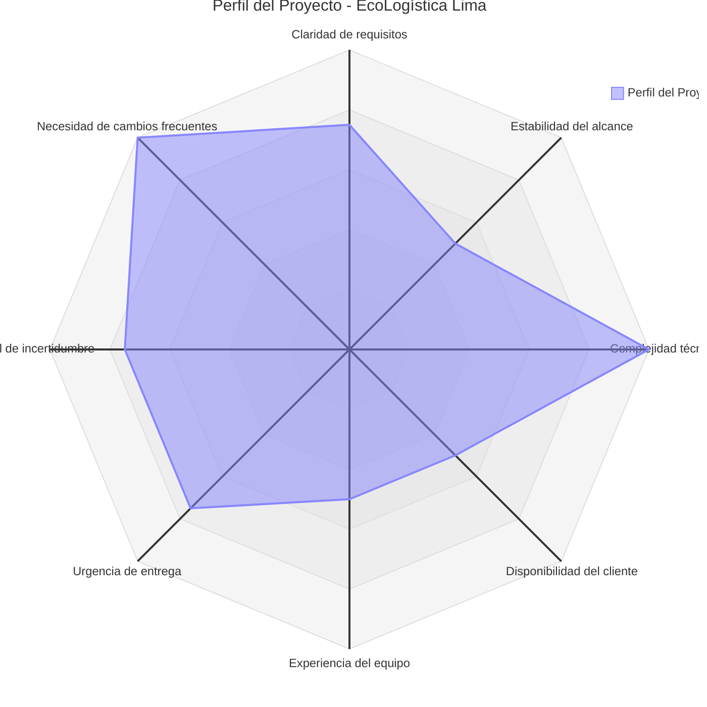

#UNIVERSIDAD CONTINENTAL
## Taller de Proyectos 2

# 01. Selección del enfoque del proyecto

**Nombre del Proyecto:** [EcoLogística Lima – Optimizador de Rutas Sostenibles para DistriRápido S.A.C.]  
###Equipo de desarrollo

| # | Nombre Completo                  | Rol                              | Tiempo de dedicación |
|---|----------------------------------|----------------------------------|----------------------|
| 1 | Carhuapoma Fano, Eilene Elizabeth   | Project Manager / Líder del Equipo | 20 h/semana         |
| 2 | Cruz Salazar, Jorge Luiz   | Integrador IA y ML            | 18 h/semana         |
| 3 | Estrada Flores, Axel Sebastian   | Tester y Full-Stack           | 18 h/semana         |
| 4 | Huaman Baldeon, Katheryn Elena   | Desarrollador Frontend  / Optimización | 16 h/semana |
| 5 | Leon Taza, Brayan Angel   | Analista Base de Datos       | 14 h/semana         |
**Fecha:** [28/08/2026]  
**Versión:** 1.0.0  

---

## 1. Matriz de Ponderación de Variables

| Variable                              | Peso (1-5) | Descripción / Justificación breve                                                                 | Puntaje asignado (1-5) |
|---------------------------------------|------------|---------------------------------------------------------------------------------------------------|------------------------|
| Claridad de requisitos                | 4          | Existen RF y RNF detallados, pero requieren adaptación al contexto geográfico y operativo de Lima | 4                      |
| Estabilidad del alcance               | 3          | El alcance puede variar por nuevos pedidos dinámicos, incidentes de tráfico y re-optimizaciones   | 3                      |
| Complejidad técnica                   | 5          | Implementación de metaheurísticas (GA/Tabú/ACO) para VRPTW + Green VRP + integración de APIs de tráfico | 5                      |
| Disponibilidad del cliente            | 3          | Cliente ficticio (DistriRápido); feedback limitado a simulaciones y validaciones de campo         | 3                      |
| Experiencia del equipo                | 3          | Equipo universitario con conocimientos intermedios de desarrollo web y algoritmos                 | 3                      |
| Urgencia de entrega                   | 4          | Cronograma académico de 14 semanas con 4 iteraciones definidas                                    | 4                      |
| Nivel de incertidumbre                | 4          | Datos de tráfico en tiempo real variables, direcciones no estandarizadas y restricciones locales  | 4                      |
| Necesidad de cambios frecuentes       | 5          | Re-optimización dinámica ante nuevos pedidos, cancelaciones, accidentes o averías                 | 5                      |
| **TOTAL**                             | **31**     |                                                                                                   | **31**                 |

> Escala: 1 = Bajo / 5 = Alto. Puntaje total alto en complejidad, incertidumbre y cambios frecuentes favorece un enfoque adaptativo.

---
## 2. Diagrama de Radar del Enfoque

*(El gráfico muestra alto puntaje en complejidad técnica, necesidad de cambios y nivel de incertidumbre, lo que orienta hacia un enfoque híbrido o ágil.)*

---

## 3. Decisión y Justificación del Enfoque

**Enfoque seleccionado:** Híbrido (Predictivo + Ágil)

**Justificación técnica (alineada a PMBOK 8ª Edición):**

De acuerdo con la *Guía de los Fundamentos para la Dirección de Proyectos* (PMBOK® Guide – 8ª Edición), la selección del enfoque de desarrollo y gestión debe basarse en las características del proyecto, el grado de incertidumbre, la estabilidad de los requisitos y la necesidad de entrega de valor incremental.

El análisis de la matriz de ponderación evidencia:

- **Alta complejidad técnica y necesidad de cambios frecuentes** (puntajes 5): la resolución del Problema de Ruteo de Vehículos con Ventanas de Tiempo (VRPTW) y consideraciones ambientales (Green VRP) mediante metaheurísticas requiere experimentación iterativa, ajuste de parámetros y validación continua del rendimiento del algoritmo (máximo 45 segundos para 150 pedidos).
- **Nivel de incertidumbre elevado** (puntaje 4): datos de tráfico en tiempo real (Waze/Google Maps), direcciones no estandarizadas en San Juan de Lurigancho y restricciones normativas locales (Decreto Supremo N° 033-2012-MTC) generan incertidumbre que se gestiona mejor con ciclos cortos de feedback.
- **Estabilidad parcial del alcance y claridad moderada de requisitos**: existen RF y RNF bien definidos, un presupuesto fijo (S/ 500 000) y un cronograma académico de 14 semanas, lo que permite planificar de forma predictiva las fases de análisis, diseño y pruebas de aceptación.

Por tanto, se adopta un **enfoque híbrido**:

1. **Fase predictiva inicial** (Iteración 1): análisis de requerimientos, diseño de arquitectura, modelado de base de datos y definición de la estructura del MVP.
2. **Fases ágiles posteriores** (Iteraciones 2-4): desarrollo incremental de los módulos (gestión de flota/pedidos → optimización de rutas → visualización y dashboard → re-optimización dinámica y reportes), con revisiones al final de cada iteración y priorización continua del backlog.

Este enfoque híbrido maximiza el control sobre el alcance y el presupuesto (características predictivas) mientras permite la adaptación rápida a los resultados del algoritmo y a las restricciones operativas reales de Lima (características ágiles), cumpliendo con los principios de entrega de valor y gestión de la incertidumbre del PMBOK 8ª Edición.
