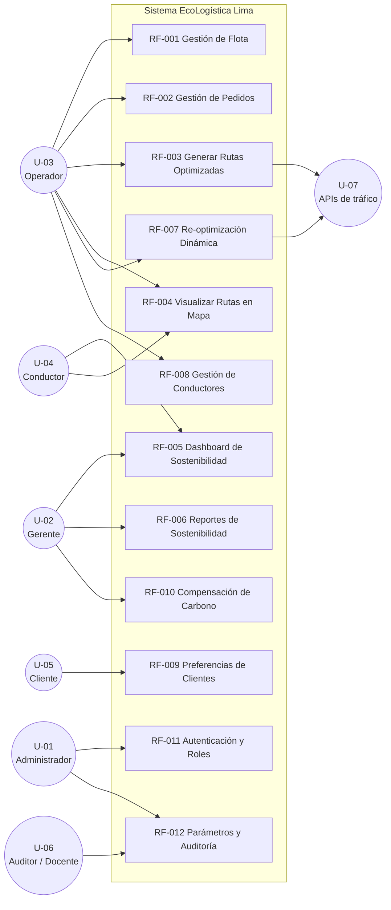

# UNIVERSIDAD CONTINENTAL
## Taller de Proyectos 2

# 08. Identificación y Perfiles de Usuarios

**Nombre del Proyecto:** EcoLogística Lima – Optimizador de Rutas Sostenibles para DistriRápido S.A.C.  
**Fecha:** 04/09/2026  
**Versión:** 1.0.1  
**Project Manager:** Carhuapoma Fano, Eilene Elizabeth  

---

## 1. Matriz de Roles y Actores

| ID   | Rol / Actor                  | Tipo          | Descripción del Perfil                                                                 | Motivaciones principales                                      | Frecuencia de uso          |
|------|------------------------------|---------------|----------------------------------------------------------------------------------------|---------------------------------------------------------------|----------------------------|
| U-01 | Administrador del Sistema    | Interno       | Responsable de la configuración global, gestión de usuarios, parámetros del algoritmo y seguridad. | Mantener el sistema operativo, seguro y alineado a la normativa. | Diaria / Semanal          |
| U-02 | Gerente de Operaciones       | Interno       | Toma de decisiones estratégicas sobre flota, costos, emisiones y cumplimiento de ventanas. | Reducir costos, mejorar cumplimiento y alcanzar metas de sostenibilidad. | Diaria                    |
| U-03 | Operador de Logística        | Interno       | Gestiona pedidos, flota, conductores y solicita optimizaciones de rutas.               | Generar rutas eficientes y reaccionar a incidencias en tiempo real. | Diaria (alta intensidad)  |
| U-04 | Conductor de Reparto         | Interno       | Ejecuta las entregas siguiendo la ruta asignada. Usa el “Modo Conductor”.              | Recibir rutas claras, seguras y cumplibles dentro de su jornada. | Diaria                    |
| U-05 | Cliente (Bodeguero / Comerciante) | Externo   | Recibe las entregas. Puede registrar preferencias de horario y puntos de referencia.   | Recibir productos dentro de la ventana de tiempo acordada.    | Por pedido                |
| U-06 | Auditor / Docente            | Externo       | Revisa avances, cumplimiento de requisitos, arquitectura y documentación.              | Evaluar el proyecto académico y la calidad del entregable.    | Por iteración             |
| U-07 | Sistema Externo (APIs)       | Externo       | Waze CCP / Google Maps / SIMAT (tráfico e incidentes).                                 | Proporcionar datos de tráfico e incidentes en tiempo real.    | Continua (bajo demanda)   |

---

## 2. Historias de Uso Resumidas (por perfil)

### U-01 – Administrador del Sistema
- Configurar parámetros del algoritmo y de sostenibilidad (tiempo máximo, pesos de la función objetivo, precio del combustible, factor de captura por árbol) — **RF-012**.
- Gestionar usuarios y roles (alta, baja, cambio de permisos) — **RF-011**.
- Revisar logs de auditoría y eventos de seguridad — **RF-012**, RNF-010.
- Realizar respaldos y monitorear salud del sistema — RNF-006.

### U-02 – Gerente de Operaciones
- Consultar dashboard de sostenibilidad (CO₂, combustible, ahorro económico).
- Descargar reportes PDF de impacto ambiental y económico.
- Analizar cumplimiento de ventanas de tiempo y costos de flota.
- Aprobar o rechazar planes de compensación de carbono.

### U-03 – Operador de Logística
- Registrar y actualizar pedidos (incluyendo puntos de referencia).
- Registrar y mantener flota y conductores.
- Solicitar generación de rutas optimizadas.
- Ejecutar re-optimización ante nuevos pedidos, cancelaciones o incidentes.
- Visualizar rutas en mapa y asignarlas a conductores.

### U-04 – Conductor de Reparto
- Iniciar sesión en “Modo Conductor”.
- Visualizar ruta asignada, secuencia de entregas y tiempos estimados.
- Confirmar entregas realizadas.
- Recibir alertas de tráfico, zonas de riesgo y cambios de ruta.
- Consultar su jornada y descansos obligatorios.

### U-05 – Cliente (Bodeguero)
- Registrar o actualizar preferencias de entrega (horarios, puntos de referencia, restricciones de acceso).
- Consultar estado estimado de su pedido (ventana de tiempo).
- Recibir notificaciones de entrega próxima (si se implementa canal).

### U-06 – Auditor / Docente
- Acceder a repositorio de documentación y código.
- Revisar métricas de cumplimiento de RF y RNF.
- Evaluar arquitectura (C4), base de datos y reportes de pruebas.

---

## 3. Matriz de Control de Acceso (RBAC)

| Módulo / Capacidad | RF asociado | Administrador | Gerente de Operaciones | Operador de Logística | Conductor | Cliente | Auditor / Docente |
|---|---|---|---|---|---|---|---|
| Gestión de Usuarios y Roles | RF-011 | CRUD | Lectura | Sin acceso | Sin acceso | Sin acceso | Sin acceso |
| Configuración de Parámetros del Algoritmo | RF-012 | CRUD | Lectura | Lectura | Sin acceso | Sin acceso | Lectura |
| Gestión de Flota (vehículos) | RF-001 | CRUD | Lectura | CRUD | Lectura | Sin acceso | Lectura |
| Gestión de Conductores | RF-008 | CRUD | Lectura | CRUD | Lectura (propia) | Sin acceso | Lectura anonimizada |
| Gestión de Pedidos | RF-002 | CRUD | Lectura | CRUD | Lectura (asignados) | Crear / Lectura (propios) | Lectura anonimizada |
| Generación y Re-optimización de Rutas | RF-003, RF-007 | Ejecutar | Ejecutar / Lectura | Ejecutar | Sin acceso | Sin acceso | Lectura |
| Visualización de Rutas en Mapa | RF-004 | Completa | Completa | Completa | Solo asignada | Sin acceso | Lectura |
| Dashboard de Sostenibilidad | RF-005 | Completo | Completo | Completo | Simplificado (Modo Conductor) | Sin acceso | Lectura |
| Reportes PDF de Sostenibilidad | RF-006 | Generar / Descargar | Generar / Descargar | Generar / Descargar | Sin acceso | Sin acceso | Lectura |
| Preferencias de Cliente | RF-009 | CRUD | Lectura | CRUD | Sin acceso | CRUD (propias) | Sin acceso |
| Plan de Compensación de Carbono | RF-010 | CRUD | Aprobar / Lectura | Lectura | Sin acceso | Sin acceso | Lectura |
| Logs de Auditoría y Eventos de Seguridad | RF-012 | Lectura completa | Lectura (operativa) | Lectura (propia) | Sin acceso | Sin acceso | Lectura (solo lectura) |
| Eliminación Física de Datos | RF-011 | D (con confirmación) | Sin acceso | Sin acceso | Sin acceso | Sin acceso | Sin acceso |

**Leyenda:**  
- **CRUD** = Crear, Leer, Actualizar, Eliminar lógico  
- **D** = Eliminación física (solo Administrador)  
- **Ejecutar** = Puede lanzar el proceso  
- **Lectura (propia / asignados)** = Solo ve sus propios registros  
- **Lectura anonimizada** = Acceso sin datos personales identificables (sin DNI, teléfono, correo ni dirección exacta del cliente)

> **Nota de cumplimiento (RN-020, RNF-002, C-05).** El perfil Auditor / Docente es un rol de evaluación académica: no accede a cuentas de usuario ni a datos personales de conductores y clientes. La información que consulta se entrega anonimizada, conforme a la Ley N° 29733 y al principio de mínimo privilegio.

---

## 4. Matriz de Interés / Influencia (complementaria)

| Rol                        | Poder | Interés | Estrategia de Gestión                  |
|----------------------------|-------|---------|----------------------------------------|
| Administrador del Sistema  | Alto  | Alto    | Gestionar de cerca                     |
| Gerente de Operaciones     | Alto  | Alto    | Gestionar de cerca                     |
| Operador de Logística      | Medio | Alto    | Mantener informado y capacitar         |
| Conductor de Reparto       | Bajo  | Alto    | Mantener informado (Modo Conductor)    |
| Cliente (Bodeguero)        | Bajo  | Medio   | Mantener informado (notificaciones)    |
| Auditor / Docente          | Alto  | Alto    | Gestionar de cerca (entregables)       |
| APIs externas (tráfico)    | Medio | Bajo    | Monitorear                             |

---

## 5. Consideraciones de Diseño orientadas a Usuarios

1. **Conductores (U-04):** Interfaz extremadamente simple, iconos grandes, alto contraste, mínimo texto, funcionamiento aceptable en 2G/3G (RNF-003, RNF-005, RNF-009).
2. **Clientes (U-05):** Formulario de preferencias sencillo, posibilidad de usar puntos de referencia en lugar de direcciones formales.
3. **Operadores y Gerentes:** Dashboard denso en información pero filtrable y exportable.
4. **Seguridad y privacidad:** Todos los roles respetan el principio de mínimo privilegio y la Ley N° 29733.
5. **Trazabilidad:** Toda acción crítica queda registrada para auditoría (RNF-010).

---

## 6. Matriz Actor – Caso de Uso (Requisitos Funcionales)

Cada requisito funcional del documento 06 se comporta como un caso de uso del sistema. La siguiente matriz identifica el actor **principal** (quien inicia el caso de uso) y los actores **secundarios** (quienes participan o consultan el resultado).

| Caso de uso (RF) | Actor principal | Actores secundarios | Módulo del sistema |
|---|---|---|---|
| RF-001 Gestión de Flota | U-03 Operador | U-01 Administrador, U-02 Gerente | Flota |
| RF-002 Gestión de Pedidos | U-03 Operador | U-05 Cliente | Pedidos |
| RF-003 Generación de Rutas Optimizadas | U-03 Operador | U-07 APIs de tráfico, U-04 Conductor | Optimización de Rutas |
| RF-004 Visualización de Rutas en Mapa | U-03 Operador | U-02 Gerente, U-04 Conductor | Mapas |
| RF-005 Dashboard de Sostenibilidad | U-02 Gerente | U-03 Operador, U-04 Conductor (modo simplificado) | Dashboard |
| RF-006 Reportes de Sostenibilidad | U-02 Gerente | U-03 Operador | Reportes |
| RF-007 Re-optimización Dinámica | U-03 Operador | U-07 APIs de tráfico, U-04 Conductor | Optimización de Rutas |
| RF-008 Gestión de Conductores | U-03 Operador | U-01 Administrador, U-04 Conductor | Conductores |
| RF-009 Preferencias de Clientes | U-05 Cliente | U-03 Operador | Clientes |
| RF-010 Plan de Compensación de Carbono | U-02 Gerente | U-01 Administrador | Sostenibilidad |
| RF-011 Autenticación, Usuarios y Roles | U-01 Administrador | Todos los roles (autenticación) | Seguridad |
| RF-012 Administración de Parámetros y Auditoría | U-01 Administrador | U-06 Auditor / Docente | Administración |

### 6.1 Vista general de casos de uso

---

**Fin del documento 08. Usuarios V_1_0_0.md**