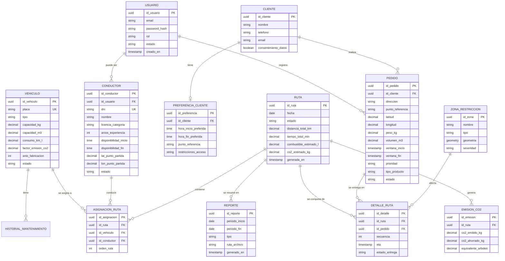

# UNIVERSIDAD CONTINENTAL
## Taller de Proyectos 2

# 11. Diseño e Ingeniería de Base de Datos

**Nombre del Proyecto:** EcoLogística Lima – Optimizador de Rutas Sostenibles para DistriRápido S.A.C.  
**Fecha:** 04/09/2026  
**Versión:** 1.0.0  
**Project Manager:** Carhuapoma Fano, Eilene Elizabeth  

---

## 1. Modelo Conceptual (Entidad-Relación)



## 2. Modelo Lógico
### 2.1 Entidades principales y atributos

| Entidad | Atributos principales | PK | FK | Normalización |
|---------|----------------------|----|----|---------------|
| Usuario | id_usuario, email, password_hash, rol, estado, creado_en | id_usuario | - | 3FN |
| Cliente | id_cliente, nombre, telefono, email, consentimiento_datos | id_cliente | - | 3FN |
| Preferencia_Cliente | id_preferencia, id_cliente, hora_inicio, hora_fin, punto_referencia, restricciones_acceso | id_preferencia | id_cliente | 3FN |
| Vehiculo | id_vehiculo, placa, tipo, capacidad_kg, capacidad_m3, consumo_km_l, factor_emision_co2, anio_fabricacion, estado | id_vehiculo | - | 3FN |
| Conductor | id_conductor, id_usuario, dni, nombre, licencia_categoria, anios_experiencia, disponibilidad_inicio, disponibilidad_fin, lat_punto_partida, lon_punto_partida, estado | id_conductor | id_usuario | 3FN |
| Pedido | id_pedido, id_cliente, direccion, punto_referencia, latitud, longitud, peso_kg, volumen_m3, ventana_inicio, ventana_fin, prioridad, tipo_producto, estado | id_pedido | id_cliente | 3FN |
| Ruta | id_ruta, fecha, estado, distancia_total_km, tiempo_total_min, combustible_estimado_l, co2_estimado_kg, generada_en | id_ruta | - | 3FN |
| Asignacion_Ruta | id_asignacion, id_ruta, id_vehiculo, id_conductor, orden_ruta | id_asignacion | id_ruta, id_vehiculo, id_conductor | 3FN |
| Detalle_Ruta | id_detalle, id_ruta, id_pedido, secuencia, eta, estado_entrega | id_detalle | id_ruta, id_pedido | 3FN |
| Zona_Restriccion | id_zona, nombre, tipo, geometria, severidad | id_zona | - | 3FN |
| Emision_CO2 | id_emision, id_ruta, co2_emitido_kg, co2_ahorrado_kg, equivalente_arboles | id_emision | id_ruta | 3FN |
| Reporte | id_reporte, periodo_inicio, periodo_fin, tipo, ruta_archivo, generado_en | id_reporte | - | 3FN |


### 2.2 Cardinalidades clave

- Un Cliente puede tener muchas Preferencias (1:N) y muchos Pedidos (1:N).
- Un Vehículo puede participar en muchas Asignaciones de Ruta (1:N).
- Un Conductor puede tener muchas Asignaciones de Ruta (1:N).
- Una Ruta se compone de muchos Detalles de Ruta (1:N) y puede tener una Emisión de CO₂ (1:1).
- Un Pedido pertenece a un solo Detalle de Ruta en un momento dado (1:1 en ejecución).

## 3. Modelo Físico (DDL PostgreSQL + PostGIS)

```
-- Extensión geoespacial
CREATE EXTENSION IF NOT EXISTS postgis;
CREATE EXTENSION IF NOT EXISTS "uuid-ossp";

-- =====================================================
-- TABLAS DE SEGURIDAD Y USUARIOS
-- =====================================================
CREATE TABLE usuario (
    id_usuario          UUID PRIMARY KEY DEFAULT uuid_generate_v4(),
    email               VARCHAR(255) NOT NULL UNIQUE,
    password_hash       VARCHAR(255) NOT NULL,
    rol                 VARCHAR(30)  NOT NULL CHECK (rol IN ('ADMIN', 'GERENTE', 'OPERADOR', 'CONDUCTOR', 'AUDITOR')),
    estado              VARCHAR(20)  NOT NULL DEFAULT 'ACTIVO' CHECK (estado IN ('ACTIVO', 'INACTIVO', 'BLOQUEADO')),
    intentos_fallidos   INT          NOT NULL DEFAULT 0,
    bloqueado_hasta     TIMESTAMPTZ,
    creado_en           TIMESTAMPTZ  NOT NULL DEFAULT CURRENT_TIMESTAMP,
    actualizado_en      TIMESTAMPTZ  NOT NULL DEFAULT CURRENT_TIMESTAMP
);

CREATE INDEX idx_usuario_email ON usuario(email);
CREATE INDEX idx_usuario_rol   ON usuario(rol);

-- =====================================================
-- CLIENTES Y PREFERENCIAS
-- =====================================================
CREATE TABLE cliente (
    id_cliente            UUID PRIMARY KEY DEFAULT uuid_generate_v4(),
    nombre                VARCHAR(150) NOT NULL,
    telefono              VARCHAR(20),
    email                 VARCHAR(255),
    consentimiento_datos  BOOLEAN      NOT NULL DEFAULT FALSE,
    creado_en             TIMESTAMPTZ  NOT NULL DEFAULT CURRENT_TIMESTAMP
);

CREATE TABLE preferencia_cliente (
    id_preferencia        UUID PRIMARY KEY DEFAULT uuid_generate_v4(),
    id_cliente            UUID         NOT NULL REFERENCES cliente(id_cliente) ON DELETE CASCADE,
    hora_inicio_preferida TIME,
    hora_fin_preferida    TIME,
    punto_referencia      VARCHAR(255),
    restricciones_acceso  TEXT,
    creado_en             TIMESTAMPTZ  NOT NULL DEFAULT CURRENT_TIMESTAMP
);

CREATE INDEX idx_preferencia_cliente ON preferencia_cliente(id_cliente);

-- =====================================================
-- FLOTA Y CONDUCTORES
-- =====================================================
CREATE TABLE vehiculo (
    id_vehiculo           UUID PRIMARY KEY DEFAULT uuid_generate_v4(),
    placa                 VARCHAR(10)  NOT NULL UNIQUE,
    tipo                  VARCHAR(30)  NOT NULL CHECK (tipo IN ('CAMIONETA', 'FURGON', 'MOTO')),
    capacidad_kg          DECIMAL(10,2) NOT NULL CHECK (capacidad_kg > 0),
    capacidad_m3          DECIMAL(10,2) NOT NULL CHECK (capacidad_m3 > 0),
    consumo_km_l          DECIMAL(8,3)  NOT NULL CHECK (consumo_km_l > 0),
    factor_emision_co2    DECIMAL(8,4)  NOT NULL CHECK (factor_emision_co2 > 0),
    anio_fabricacion      INT          NOT NULL CHECK (anio_fabricacion BETWEEN 1990 AND 2030),
    estado                VARCHAR(20)  NOT NULL DEFAULT 'ACTIVO' CHECK (estado IN ('ACTIVO', 'MANTENIMIENTO', 'INACTIVO')),
    creado_en             TIMESTAMPTZ  NOT NULL DEFAULT CURRENT_TIMESTAMP
);

CREATE INDEX idx_vehiculo_placa  ON vehiculo(placa);
CREATE INDEX idx_vehiculo_estado ON vehiculo(estado);

CREATE TABLE conductor (
    id_conductor          UUID PRIMARY KEY DEFAULT uuid_generate_v4(),
    id_usuario            UUID         REFERENCES usuario(id_usuario),
    dni                   VARCHAR(15)  NOT NULL UNIQUE,
    nombre                VARCHAR(150) NOT NULL,
    licencia_categoria    VARCHAR(10)  NOT NULL,
    anios_experiencia     INT          NOT NULL DEFAULT 0 CHECK (anios_experiencia >= 0),
    disponibilidad_inicio TIME         NOT NULL,
    disponibilidad_fin    TIME         NOT NULL,
    lat_punto_partida     DECIMAL(10,7),
    lon_punto_partida     DECIMAL(10,7),
    estado                VARCHAR(20)  NOT NULL DEFAULT 'ACTIVO' CHECK (estado IN ('ACTIVO', 'INACTIVO', 'VACACIONES')),
    creado_en             TIMESTAMPTZ  NOT NULL DEFAULT CURRENT_TIMESTAMP,
    CONSTRAINT chk_disponibilidad CHECK (disponibilidad_inicio < disponibilidad_fin)
);

CREATE INDEX idx_conductor_dni    ON conductor(dni);
CREATE INDEX idx_conductor_estado ON conductor(estado);

-- =====================================================
-- PEDIDOS
-- =====================================================
CREATE TABLE pedido (
    id_pedido             UUID PRIMARY KEY DEFAULT uuid_generate_v4(),
    id_cliente            UUID         NOT NULL REFERENCES cliente(id_cliente),
    direccion             VARCHAR(255),
    punto_referencia      VARCHAR(255),
    latitud               DECIMAL(10,7) NOT NULL,
    longitud              DECIMAL(10,7) NOT NULL,
    peso_kg               DECIMAL(10,2) NOT NULL CHECK (peso_kg > 0),
    volumen_m3            DECIMAL(10,3) NOT NULL CHECK (volumen_m3 > 0),
    ventana_inicio        TIMESTAMPTZ  NOT NULL,
    ventana_fin           TIMESTAMPTZ  NOT NULL,
    prioridad             VARCHAR(20)  NOT NULL DEFAULT 'ESTANDAR' CHECK (prioridad IN ('EXPRESS', 'ESTANDAR', 'ECONOMICO')),
    tipo_producto         VARCHAR(30)  NOT NULL CHECK (tipo_producto IN ('PERECEDERO', 'NO_PERECEDERO')),
    estado                VARCHAR(20)  NOT NULL DEFAULT 'PENDIENTE' CHECK (estado IN ('PENDIENTE', 'ASIGNADO', 'EN_TRANSITO', 'ENTREGADO', 'CANCELADO')),
    creado_en             TIMESTAMPTZ  NOT NULL DEFAULT CURRENT_TIMESTAMP,
    CONSTRAINT chk_ventana CHECK (ventana_inicio < ventana_fin)
);

CREATE INDEX idx_pedido_estado     ON pedido(estado);
CREATE INDEX idx_pedido_cliente    ON pedido(id_cliente);
CREATE INDEX idx_pedido_ventana    ON pedido(ventana_inicio, ventana_fin);
CREATE INDEX idx_pedido_ubicacion  ON pedido(latitud, longitud);

-- =====================================================
-- RUTAS Y ASIGNACIONES
-- =====================================================
CREATE TABLE ruta (
    id_ruta               UUID PRIMARY KEY DEFAULT uuid_generate_v4(),
    fecha                 DATE         NOT NULL,
    estado                VARCHAR(20)  NOT NULL DEFAULT 'BORRADOR' CHECK (estado IN ('BORRADOR', 'CONFIRMADA', 'EN_EJECUCION', 'FINALIZADA', 'CANCELADA')),
    distancia_total_km    DECIMAL(10,2),
    tiempo_total_min      DECIMAL(10,2),
    combustible_estimado_l DECIMAL(10,2),
    co2_estimado_kg       DECIMAL(10,3),
    generada_en           TIMESTAMPTZ  NOT NULL DEFAULT CURRENT_TIMESTAMP
);

CREATE INDEX idx_ruta_fecha  ON ruta(fecha);
CREATE INDEX idx_ruta_estado ON ruta(estado);

CREATE TABLE asignacion_ruta (
    id_asignacion         UUID PRIMARY KEY DEFAULT uuid_generate_v4(),
    id_ruta               UUID NOT NULL REFERENCES ruta(id_ruta) ON DELETE CASCADE,
    id_vehiculo           UUID NOT NULL REFERENCES vehiculo(id_vehiculo),
    id_conductor          UUID NOT NULL REFERENCES conductor(id_conductor),
    orden_ruta            INT  NOT NULL CHECK (orden_ruta > 0),
    UNIQUE (id_ruta, id_vehiculo),
    UNIQUE (id_ruta, id_conductor)
);

CREATE TABLE detalle_ruta (
    id_detalle            UUID PRIMARY KEY DEFAULT uuid_generate_v4(),
    id_ruta               UUID NOT NULL REFERENCES ruta(id_ruta) ON DELETE CASCADE,
    id_pedido             UUID NOT NULL REFERENCES pedido(id_pedido),
    secuencia             INT  NOT NULL CHECK (secuencia > 0),
    eta                   TIMESTAMPTZ,
    estado_entrega        VARCHAR(20) DEFAULT 'PENDIENTE' CHECK (estado_entrega IN ('PENDIENTE', 'ENTREGADO', 'FALLIDO', 'REPROGRAMADO')),
    UNIQUE (id_ruta, id_pedido),
    UNIQUE (id_ruta, secuencia)
);

CREATE INDEX idx_detalle_ruta_pedido ON detalle_ruta(id_pedido);

-- =====================================================
-- ZONAS DE RESTRICCIÓN (PostGIS)
-- =====================================================
CREATE TABLE zona_restriccion (
    id_zona               UUID PRIMARY KEY DEFAULT uuid_generate_v4(),
    nombre                VARCHAR(150) NOT NULL,
    tipo                  VARCHAR(30)  NOT NULL CHECK (tipo IN ('RIESGO_SEGURIDAD', 'RESERVA_ECOLOGICA', 'RESTRICCION_HORARIA', 'CENTRO_HISTORICO')),
    geometria             GEOMETRY(Polygon, 4326) NOT NULL,
    severidad             VARCHAR(20)  NOT NULL DEFAULT 'MEDIA' CHECK (severidad IN ('BAJA', 'MEDIA', 'ALTA')),
    activo                BOOLEAN      NOT NULL DEFAULT TRUE
);

CREATE INDEX idx_zona_geometria ON zona_restriccion USING GIST (geometria);

-- =====================================================
-- EMISIONES Y REPORTES
-- =====================================================
CREATE TABLE emision_co2 (
    id_emision            UUID PRIMARY KEY DEFAULT uuid_generate_v4(),
    id_ruta               UUID NOT NULL REFERENCES ruta(id_ruta) ON DELETE CASCADE,
    co2_emitido_kg        DECIMAL(12,3) NOT NULL,
    co2_ahorrado_kg       DECIMAL(12,3),
    equivalente_arboles   DECIMAL(10,2),
    calculado_en          TIMESTAMPTZ NOT NULL DEFAULT CURRENT_TIMESTAMP
);

CREATE TABLE reporte (
    id_reporte            UUID PRIMARY KEY DEFAULT uuid_generate_v4(),
    periodo_inicio        DATE NOT NULL,
    periodo_fin           DATE NOT NULL,
    tipo                  VARCHAR(50) NOT NULL,
    ruta_archivo          VARCHAR(500),
    generado_en           TIMESTAMPTZ NOT NULL DEFAULT CURRENT_TIMESTAMP,
    generado_por          UUID REFERENCES usuario(id_usuario)
);

-- =====================================================
-- AUDITORÍA BÁSICA
-- =====================================================
CREATE TABLE log_auditoria (
    id_log                UUID PRIMARY KEY DEFAULT uuid_generate_v4(),
    id_usuario            UUID REFERENCES usuario(id_usuario),
    accion                VARCHAR(100) NOT NULL,
    tabla_afectada        VARCHAR(50),
    registro_id           UUID,
    datos_anteriores      JSONB,
    datos_nuevos          JSONB,
    ip_origen             INET,
    creado_en             TIMESTAMPTZ NOT NULL DEFAULT CURRENT_TIMESTAMP
);

CREATE INDEX idx_log_usuario ON log_auditoria(id_usuario);
CREATE INDEX idx_log_fecha   ON log_auditoria(creado_en);
```
## 4. Índices Estratégicos y Consideraciones de Rendimiento

| Índice | Tabla | Propósito |
|--------|-------|-----------|
| idx_pedido_estado | pedido | Filtros rápidos de pedidos pendientes |
| idx_pedido_ventana | pedido | Consultas por ventanas de tiempo |
| idx_pedido_ubicacion | pedido | Búsquedas geoespaciales simples |
| idx_zona_geometria (GIST) | zona_restriccion | Intersección de rutas con zonas restringidas |
| idx_ruta_fecha | ruta | Reportes por período |
| idx_detalle_ruta_pedido | detalle_ruta | Trazabilidad pedido → ruta |

## 5. Decisiones de Diseño

1. Normalización 3FN en todas las entidades transaccionales.
2. PostGIS para zonas de restricción (seguridad y ecológicas).
3. UUIDs como claves primarias para facilitar distribución y seguridad.
4. Constraints CHECK para reglas de negocio críticas (RN-002, RN-004, RN-007, etc.).
5. Soft delete se manejará a nivel de aplicación mediante el campo estado (no se eliminan físicamente pedidos ni rutas históricas).
6. Auditoría centralizada en log_auditoria para cumplir RNF-010 y Ley N° 29733.