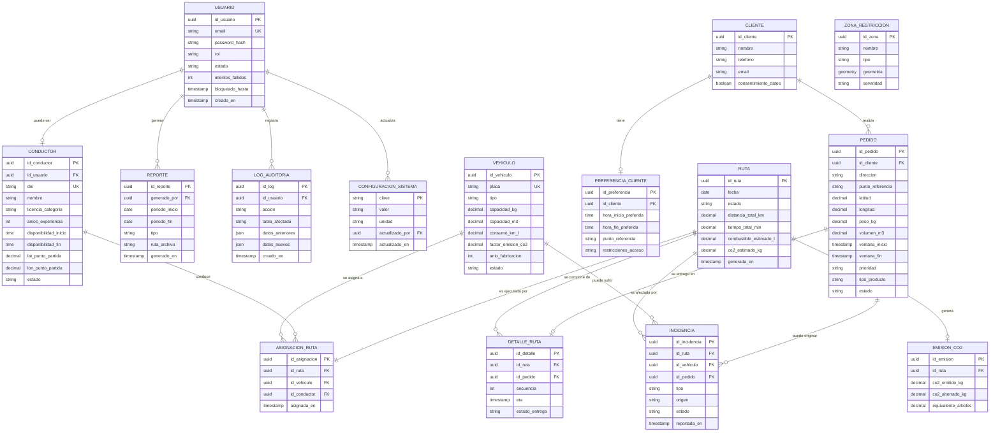

# UNIVERSIDAD CONTINENTAL
## Taller de Proyectos 2

# 11. Diseño e Ingeniería de Base de Datos

**Nombre del Proyecto:** EcoLogística Lima – Optimizador de Rutas Sostenibles para DistriRápido S.A.C.  
**Fecha:** 04/09/2026  
**Versión:** 1.0.1  
**Project Manager:** Carhuapoma Fano, Eilene Elizabeth  

---

## 1. Modelo Conceptual (Entidad-Relación)



> **Nota sobre ZONA_RESTRICCION.** Esta entidad no se relaciona con las rutas mediante claves foráneas, sino **geoespacialmente**: el motor de optimización consulta las zonas mediante funciones PostGIS (`ST_Intersects`) sobre el trazado de cada ruta. Por eso aparece en el modelo sin relación referencial con `DETALLE_RUTA` (reglas RN-012 y RN-013).

## 2. Modelo Lógico
### 2.1 Entidades principales y atributos

| Entidad | Atributos principales | PK | FK | Normalización |
|---------|----------------------|----|----|---------------|
| Usuario | id_usuario, email, password_hash, rol, estado, intentos_fallidos, bloqueado_hasta, creado_en | id_usuario | - | 3FN |
| Cliente | id_cliente, nombre, telefono, email, consentimiento_datos | id_cliente | - | 3FN |
| Preferencia_Cliente | id_preferencia, id_cliente, hora_inicio, hora_fin, punto_referencia, restricciones_acceso | id_preferencia | id_cliente | 3FN |
| Vehiculo | id_vehiculo, placa, tipo, capacidad_kg, capacidad_m3, consumo_km_l, factor_emision_co2, anio_fabricacion, estado | id_vehiculo | - | 3FN |
| Conductor | id_conductor, id_usuario, dni, nombre, licencia_categoria, anios_experiencia, disponibilidad_inicio, disponibilidad_fin, lat_punto_partida, lon_punto_partida, estado | id_conductor | id_usuario | 3FN |
| Pedido | id_pedido, id_cliente, direccion, punto_referencia, latitud, longitud, peso_kg, volumen_m3, ventana_inicio, ventana_fin, prioridad, tipo_producto, estado | id_pedido | id_cliente | 3FN |
| Ruta | id_ruta, fecha, estado, distancia_total_km, tiempo_total_min, combustible_estimado_l, co2_estimado_kg, generada_en | id_ruta | - | 3FN |
| Asignacion_Ruta | id_asignacion, id_ruta, id_vehiculo, id_conductor, asignada_en | id_asignacion | id_ruta (único), id_vehiculo, id_conductor | 3FN |
| Detalle_Ruta | id_detalle, id_ruta, id_pedido, secuencia, eta, estado_entrega | id_detalle | id_ruta, id_pedido | 3FN |
| Zona_Restriccion | id_zona, nombre, tipo, geometria, severidad | id_zona | - | 3FN |
| Emision_CO2 | id_emision, id_ruta, co2_emitido_kg, co2_ahorrado_kg, equivalente_arboles | id_emision | id_ruta | 3FN |
| Reporte | id_reporte, generado_por, periodo_inicio, periodo_fin, tipo, ruta_archivo, generado_en | id_reporte | generado_por | 3FN |
| Incidencia | id_incidencia, tipo, origen, id_ruta, id_vehiculo, id_pedido, descripcion, latitud, longitud, estado, reportada_en, resuelta_en | id_incidencia | id_ruta, id_vehiculo, id_pedido | 3FN |
| Configuracion_Sistema | clave, valor, unidad, descripcion, actualizado_por, actualizado_en | clave | actualizado_por | 3FN |
| Log_Auditoria | id_log, id_usuario, accion, tabla_afectada, registro_id, datos_anteriores, datos_nuevos, ip_origen, creado_en | id_log | id_usuario | 3FN |


### 2.2 Cardinalidades clave

- Un Cliente tiene **como máximo un** registro de preferencias de entrega (1:0..1) y puede tener muchos Pedidos (1:N).
- Una Ruta corresponde a **un solo vehículo y un solo conductor**: la relación Ruta – Asignación de Ruta es 1:1. Un plan de reparto diario está formado por varias filas de `ruta` que comparten la misma fecha, una por vehículo en operación.
- Un Vehículo puede participar en muchas Asignaciones de Ruta a lo largo del tiempo (1:N); un Conductor también (1:N).
- Una Ruta se compone de muchos Detalles de Ruta (1:N) y genera como máximo un registro de Emisión de CO₂ (1:0..1).
- Un Pedido aparece como máximo en un Detalle de Ruta activo (1:0..1), lo que garantiza que no se asigne a dos vehículos a la vez.
- Un Usuario puede estar vinculado como máximo a un Conductor (1:0..1).
- Una Ruta y un Vehículo pueden verse afectados por muchas Incidencias (1:N), que son el disparador de la re-optimización dinámica (RF-007, RN-015).

> Esta decisión —una ruta por vehículo— es coherente con los atributos de la entidad `ruta` (`distancia_total_km`, `combustible_estimado_l`, `co2_estimado_kg`), que son métricas **por vehículo** y no del plan completo del día.

## 3. Modelo Físico (DDL PostgreSQL + PostGIS)

```sql
-- Extensión geoespacial
CREATE EXTENSION IF NOT EXISTS postgis;
CREATE EXTENSION IF NOT EXISTS "uuid-ossp";

-- =====================================================
-- TABLAS DE SEGURIDAD Y USUARIOS
-- =====================================================
CREATE TABLE usuario (
    id_usuario          UUID PRIMARY KEY DEFAULT uuid_generate_v4(),
    email               VARCHAR(255) NOT NULL UNIQUE,
    password_hash       VARCHAR(255) NOT NULL,
    rol                 VARCHAR(30)  NOT NULL CHECK (rol IN ('ADMIN', 'GERENTE', 'OPERADOR', 'CONDUCTOR', 'AUDITOR')),
    estado              VARCHAR(20)  NOT NULL DEFAULT 'ACTIVO' CHECK (estado IN ('ACTIVO', 'INACTIVO', 'BLOQUEADO')),
    intentos_fallidos   INT          NOT NULL DEFAULT 0,
    bloqueado_hasta     TIMESTAMPTZ,
    creado_en           TIMESTAMPTZ  NOT NULL DEFAULT CURRENT_TIMESTAMP,
    actualizado_en      TIMESTAMPTZ  NOT NULL DEFAULT CURRENT_TIMESTAMP
);

CREATE INDEX idx_usuario_email ON usuario(email);
CREATE INDEX idx_usuario_rol   ON usuario(rol);

-- =====================================================
-- CLIENTES Y PREFERENCIAS
-- =====================================================
CREATE TABLE cliente (
    id_cliente            UUID PRIMARY KEY DEFAULT uuid_generate_v4(),
    nombre                VARCHAR(150) NOT NULL,
    telefono              VARCHAR(20),
    email                 VARCHAR(255),
    consentimiento_datos  BOOLEAN      NOT NULL DEFAULT FALSE,
    creado_en             TIMESTAMPTZ  NOT NULL DEFAULT CURRENT_TIMESTAMP
);

CREATE TABLE preferencia_cliente (
    id_preferencia        UUID PRIMARY KEY DEFAULT uuid_generate_v4(),
    id_cliente            UUID         NOT NULL UNIQUE REFERENCES cliente(id_cliente) ON DELETE CASCADE,
    hora_inicio_preferida TIME,
    hora_fin_preferida    TIME,
    punto_referencia      VARCHAR(255),
    restricciones_acceso  TEXT,
    creado_en             TIMESTAMPTZ  NOT NULL DEFAULT CURRENT_TIMESTAMP,
    CONSTRAINT chk_horario_preferido CHECK (hora_inicio_preferida < hora_fin_preferida)
);
-- La restricción UNIQUE sobre id_cliente implementa la cardinalidad 1:0..1 (un cliente, una ficha de preferencias, RF-009).

-- =====================================================
-- FLOTA Y CONDUCTORES
-- =====================================================
CREATE TABLE vehiculo (
    id_vehiculo           UUID PRIMARY KEY DEFAULT uuid_generate_v4(),
    placa                 VARCHAR(10)  NOT NULL UNIQUE,
    tipo                  VARCHAR(30)  NOT NULL CHECK (tipo IN ('CAMIONETA', 'FURGON', 'MOTO')),
    capacidad_kg          DECIMAL(10,2) NOT NULL CHECK (capacidad_kg > 0),
    capacidad_m3          DECIMAL(10,2) NOT NULL CHECK (capacidad_m3 > 0),
    consumo_km_l          DECIMAL(8,3)  NOT NULL CHECK (consumo_km_l > 0),
    factor_emision_co2    DECIMAL(8,4)  NOT NULL CHECK (factor_emision_co2 > 0),
    anio_fabricacion      INT          NOT NULL CHECK (anio_fabricacion >= 1990),
    -- El rechazo de años futuros (RF-001, ruta infeliz) se valida en la capa de aplicación:
    -- PostgreSQL no admite funciones no inmutables como CURRENT_DATE dentro de un CHECK.
    estado                VARCHAR(20)  NOT NULL DEFAULT 'ACTIVO' CHECK (estado IN ('ACTIVO', 'MANTENIMIENTO', 'INACTIVO')),
    creado_en             TIMESTAMPTZ  NOT NULL DEFAULT CURRENT_TIMESTAMP
);

CREATE INDEX idx_vehiculo_placa  ON vehiculo(placa);
CREATE INDEX idx_vehiculo_estado ON vehiculo(estado);

CREATE TABLE conductor (
    id_conductor          UUID PRIMARY KEY DEFAULT uuid_generate_v4(),
    id_usuario            UUID         UNIQUE REFERENCES usuario(id_usuario),
    dni                   VARCHAR(15)  NOT NULL UNIQUE,
    nombre                VARCHAR(150) NOT NULL,
    licencia_categoria    VARCHAR(10)  NOT NULL,
    anios_experiencia     INT          NOT NULL DEFAULT 0 CHECK (anios_experiencia >= 0),
    disponibilidad_inicio TIME         NOT NULL,
    disponibilidad_fin    TIME         NOT NULL,
    lat_punto_partida     DECIMAL(10,7),
    lon_punto_partida     DECIMAL(10,7),
    estado                VARCHAR(20)  NOT NULL DEFAULT 'ACTIVO' CHECK (estado IN ('ACTIVO', 'INACTIVO', 'VACACIONES')),
    creado_en             TIMESTAMPTZ  NOT NULL DEFAULT CURRENT_TIMESTAMP,
    CONSTRAINT chk_disponibilidad CHECK (disponibilidad_inicio < disponibilidad_fin)
);

CREATE INDEX idx_conductor_dni    ON conductor(dni);
CREATE INDEX idx_conductor_estado ON conductor(estado);

-- =====================================================
-- PEDIDOS
-- =====================================================
CREATE TABLE pedido (
    id_pedido             UUID PRIMARY KEY DEFAULT uuid_generate_v4(),
    id_cliente            UUID         NOT NULL REFERENCES cliente(id_cliente),
    direccion             VARCHAR(255),
    punto_referencia      VARCHAR(255),
    latitud               DECIMAL(10,7) NOT NULL,
    longitud              DECIMAL(10,7) NOT NULL,
    peso_kg               DECIMAL(10,2) NOT NULL CHECK (peso_kg > 0),
    volumen_m3            DECIMAL(10,3) NOT NULL CHECK (volumen_m3 > 0),
    ventana_inicio        TIMESTAMPTZ  NOT NULL,
    ventana_fin           TIMESTAMPTZ  NOT NULL,
    prioridad             VARCHAR(20)  NOT NULL DEFAULT 'ESTANDAR' CHECK (prioridad IN ('EXPRESS', 'ESTANDAR', 'ECONOMICO')),
    tipo_producto         VARCHAR(30)  NOT NULL CHECK (tipo_producto IN ('PERECEDERO', 'NO_PERECEDERO')),
    estado                VARCHAR(20)  NOT NULL DEFAULT 'PENDIENTE' CHECK (estado IN ('PENDIENTE', 'ASIGNADO', 'EN_TRANSITO', 'ENTREGADO', 'CANCELADO')),
    creado_en             TIMESTAMPTZ  NOT NULL DEFAULT CURRENT_TIMESTAMP,
    CONSTRAINT chk_ventana CHECK (ventana_inicio < ventana_fin)
);

CREATE INDEX idx_pedido_estado     ON pedido(estado);
CREATE INDEX idx_pedido_cliente    ON pedido(id_cliente);
CREATE INDEX idx_pedido_ventana    ON pedido(ventana_inicio, ventana_fin);
CREATE INDEX idx_pedido_ubicacion  ON pedido(latitud, longitud);

-- =====================================================
-- RUTAS Y ASIGNACIONES
-- =====================================================
CREATE TABLE ruta (
    id_ruta               UUID PRIMARY KEY DEFAULT uuid_generate_v4(),
    fecha                 DATE         NOT NULL,
    estado                VARCHAR(20)  NOT NULL DEFAULT 'BORRADOR' CHECK (estado IN ('BORRADOR', 'CONFIRMADA', 'EN_EJECUCION', 'FINALIZADA', 'CANCELADA')),
    distancia_total_km    DECIMAL(10,2),
    tiempo_total_min      DECIMAL(10,2),
    combustible_estimado_l DECIMAL(10,2),
    co2_estimado_kg       DECIMAL(10,3),
    generada_en           TIMESTAMPTZ  NOT NULL DEFAULT CURRENT_TIMESTAMP
);

CREATE INDEX idx_ruta_fecha  ON ruta(fecha);
CREATE INDEX idx_ruta_estado ON ruta(estado);

CREATE TABLE asignacion_ruta (
    id_asignacion         UUID PRIMARY KEY DEFAULT uuid_generate_v4(),
    id_ruta               UUID NOT NULL UNIQUE REFERENCES ruta(id_ruta) ON DELETE CASCADE,
    id_vehiculo           UUID NOT NULL REFERENCES vehiculo(id_vehiculo),
    id_conductor          UUID NOT NULL REFERENCES conductor(id_conductor),
    asignada_en           TIMESTAMPTZ NOT NULL DEFAULT CURRENT_TIMESTAMP
);
-- UNIQUE(id_ruta): cada ruta se ejecuta con un único vehículo y un único conductor.
-- El orden de las entregas dentro de la ruta se registra en detalle_ruta.secuencia.

CREATE INDEX idx_asignacion_vehiculo  ON asignacion_ruta(id_vehiculo);
CREATE INDEX idx_asignacion_conductor ON asignacion_ruta(id_conductor);

CREATE TABLE detalle_ruta (
    id_detalle            UUID PRIMARY KEY DEFAULT uuid_generate_v4(),
    id_ruta               UUID NOT NULL REFERENCES ruta(id_ruta) ON DELETE CASCADE,
    id_pedido             UUID NOT NULL REFERENCES pedido(id_pedido),
    secuencia             INT  NOT NULL CHECK (secuencia > 0),
    eta                   TIMESTAMPTZ,
    estado_entrega        VARCHAR(20) DEFAULT 'PENDIENTE' CHECK (estado_entrega IN ('PENDIENTE', 'ENTREGADO', 'FALLIDO', 'REPROGRAMADO')),
    UNIQUE (id_ruta, id_pedido),
    UNIQUE (id_ruta, secuencia)
);

CREATE INDEX idx_detalle_ruta_pedido ON detalle_ruta(id_pedido);

-- =====================================================
-- ZONAS DE RESTRICCIÓN (PostGIS)
-- =====================================================
CREATE TABLE zona_restriccion (
    id_zona               UUID PRIMARY KEY DEFAULT uuid_generate_v4(),
    nombre                VARCHAR(150) NOT NULL,
    tipo                  VARCHAR(30)  NOT NULL CHECK (tipo IN ('RIESGO_SEGURIDAD', 'RESERVA_ECOLOGICA', 'RESTRICCION_HORARIA', 'CENTRO_HISTORICO', 'VIA_NO_PAVIMENTADA', 'BAJA_VISIBILIDAD')),
    geometria             GEOMETRY(Polygon, 4326) NOT NULL,
    severidad             VARCHAR(20)  NOT NULL DEFAULT 'MEDIA' CHECK (severidad IN ('BAJA', 'MEDIA', 'ALTA')),
    activo                BOOLEAN      NOT NULL DEFAULT TRUE
);

CREATE INDEX idx_zona_geometria ON zona_restriccion USING GIST (geometria);

-- =====================================================
-- EMISIONES Y REPORTES
-- =====================================================
CREATE TABLE emision_co2 (
    id_emision            UUID PRIMARY KEY DEFAULT uuid_generate_v4(),
    id_ruta               UUID NOT NULL UNIQUE REFERENCES ruta(id_ruta) ON DELETE CASCADE,
    co2_emitido_kg        DECIMAL(12,3) NOT NULL,
    co2_ahorrado_kg       DECIMAL(12,3),
    equivalente_arboles   DECIMAL(10,2),
    calculado_en          TIMESTAMPTZ NOT NULL DEFAULT CURRENT_TIMESTAMP
);

CREATE TABLE reporte (
    id_reporte            UUID PRIMARY KEY DEFAULT uuid_generate_v4(),
    periodo_inicio        DATE NOT NULL,
    periodo_fin           DATE NOT NULL,
    tipo                  VARCHAR(50) NOT NULL,
    ruta_archivo          VARCHAR(500),
    generado_en           TIMESTAMPTZ NOT NULL DEFAULT CURRENT_TIMESTAMP,
    generado_por          UUID REFERENCES usuario(id_usuario)
);

-- =====================================================
-- INCIDENCIAS Y RE-OPTIMIZACIÓN DINÁMICA (RF-007 / RN-015)
-- =====================================================
CREATE TABLE incidencia (
    id_incidencia         UUID PRIMARY KEY DEFAULT uuid_generate_v4(),
    tipo                  VARCHAR(30)  NOT NULL CHECK (tipo IN ('NUEVO_PEDIDO', 'CANCELACION', 'ACCIDENTE_TRANSITO', 'AVERIA_VEHICULO', 'CONGESTION')),
    origen                VARCHAR(20)  NOT NULL DEFAULT 'MANUAL' CHECK (origen IN ('MANUAL', 'API_TRAFICO')),
    id_ruta               UUID REFERENCES ruta(id_ruta),
    id_vehiculo           UUID REFERENCES vehiculo(id_vehiculo),
    id_pedido             UUID REFERENCES pedido(id_pedido),
    descripcion           VARCHAR(255),
    latitud               DECIMAL(10,7),
    longitud              DECIMAL(10,7),
    estado                VARCHAR(20)  NOT NULL DEFAULT 'PENDIENTE' CHECK (estado IN ('PENDIENTE', 'REOPTIMIZADA', 'SIN_SOLUCION', 'DESCARTADA')),
    reportada_en          TIMESTAMPTZ  NOT NULL DEFAULT CURRENT_TIMESTAMP,
    resuelta_en           TIMESTAMPTZ
);

CREATE INDEX idx_incidencia_estado ON incidencia(estado);
CREATE INDEX idx_incidencia_ruta   ON incidencia(id_ruta);

-- El campo origen soporta la carga manual de datos de tráfico prevista como
-- respaldo en el acta de constitución (documento 02), cuando las APIs de
-- Waze/Google Maps no tienen cobertura en zonas periféricas.

-- =====================================================
-- CONFIGURACIÓN DEL SISTEMA (RF-012)
-- =====================================================
CREATE TABLE configuracion_sistema (
    clave                 VARCHAR(60) PRIMARY KEY,
    valor                 VARCHAR(255) NOT NULL,
    unidad                VARCHAR(30),
    descripcion           VARCHAR(255),
    actualizado_por       UUID REFERENCES usuario(id_usuario),
    actualizado_en        TIMESTAMPTZ  NOT NULL DEFAULT CURRENT_TIMESTAMP
);

-- Valores iniciales tomados de la consigna del proyecto
INSERT INTO configuracion_sistema (clave, valor, unidad, descripcion) VALUES
  ('tiempo_max_optimizacion_s',   '45',    'segundos',   'Tope de cómputo de la generación inicial de rutas (RN-014)'),
  ('tiempo_max_reoptimizacion_s', '30',    'segundos',   'Tope de cómputo de la re-optimización dinámica (RN-014)'),
  ('precio_diesel_galon',         '17.50', 'S/ / galón', 'Precio de referencia del diésel en Lima al 2026 (RN-017)'),
  ('costo_mantenimiento_km',      '1.20',  'S/ / km',    'Costo promedio de mantenimiento por km recorrido (RN-017)');

-- Pendiente de Iteración 3: registrar la clave 'factor_captura_arbol_kg' (RN-018)
-- con el valor de captura de CO2 por árbol que se defina con el docente a partir
-- del programa "Árboles para Lima" de la Municipalidad de Lima.

-- =====================================================
-- AUDITORÍA BÁSICA
-- =====================================================
CREATE TABLE log_auditoria (
    id_log                UUID PRIMARY KEY DEFAULT uuid_generate_v4(),
    id_usuario            UUID REFERENCES usuario(id_usuario),
    accion                VARCHAR(100) NOT NULL,
    tabla_afectada        VARCHAR(50),
    registro_id           UUID,
    datos_anteriores      JSONB,
    datos_nuevos          JSONB,
    ip_origen             INET,
    creado_en             TIMESTAMPTZ NOT NULL DEFAULT CURRENT_TIMESTAMP
);

CREATE INDEX idx_log_usuario ON log_auditoria(id_usuario);
CREATE INDEX idx_log_fecha   ON log_auditoria(creado_en);
```
## 4. Índices Estratégicos y Consideraciones de Rendimiento

| Índice | Tabla | Propósito |
|--------|-------|-----------|
| idx_pedido_estado | pedido | Filtros rápidos de pedidos pendientes |
| idx_pedido_ventana | pedido | Consultas por ventanas de tiempo |
| idx_pedido_ubicacion | pedido | Búsquedas geoespaciales simples |
| idx_zona_geometria (GIST) | zona_restriccion | Intersección de rutas con zonas restringidas |
| idx_ruta_fecha | ruta | Reportes por período |
| idx_detalle_ruta_pedido | detalle_ruta | Trazabilidad pedido → ruta |
| idx_incidencia_estado | incidencia | Detección de eventos pendientes de re-optimización (RF-007) |
| idx_log_fecha | log_auditoria | Consultas de auditoría por período (RNF-010) |

## 5. Decisiones de Diseño

1. Normalización 3FN en todas las entidades transaccionales.
2. PostGIS para zonas de restricción (seguridad y ecológicas).
3. UUIDs como claves primarias para facilitar distribución y seguridad.
4. Constraints CHECK para reglas de negocio críticas (RN-002, RN-004, RN-007, etc.).
5. Soft delete se manejará a nivel de aplicación mediante el campo estado (no se eliminan físicamente pedidos ni rutas históricas).
6. Auditoría centralizada en log_auditoria para cumplir RNF-010 y Ley N° 29733.
7. Una ruta corresponde a un vehículo y un conductor (UNIQUE sobre `asignacion_ruta.id_ruta`). El plan diario es el conjunto de rutas de una misma fecha; esto permite calcular combustible, distancia y CO₂ por vehículo sin ambigüedad.
8. Relación geoespacial en lugar de referencial para `zona_restriccion`: las reglas RN-012 y RN-013 se evalúan con funciones PostGIS sobre el trazado de la ruta, no con claves foráneas.
9. Parámetros de negocio externalizados en `configuracion_sistema`, de modo que RN-014, RN-016, RN-017 y RN-018 puedan ajustarse sin modificar el código (RF-012).
10. Reglas de negocio implementadas en la base de datos mediante `CHECK` y `UNIQUE`: RN-001 (placa única), RN-002 (capacidad > 0), RN-003 (factor de emisión > 0), RN-004 (ventana válida). Las reglas que dependen del cálculo de rutas (RN-006 a RN-015) se implementan en el motor de optimización y en la capa de servicios.
11. La cobertura geográfica (RN-005) se valida en la capa de aplicación contra los polígonos distritales de San Juan de Lurigancho, El Agustino, Santa Anita y Ate; no se implementa como `CHECK` porque requiere consultas geoespaciales.

---

## 6. Trazabilidad de la Base de Datos con los Requisitos

| Tabla | Requisitos funcionales | Reglas de negocio | Módulo del sistema (doc. 08 y 12) |
|---|---|---|---|
| usuario | RF-011 | RN-019 | Seguridad / Auth |
| cliente | RF-002, RF-009 | RN-020 | Clientes |
| preferencia_cliente | RF-009 | RN-020 | Clientes |
| vehiculo | RF-001, RF-003 | RN-001, RN-002, RN-003, RN-006, RN-009 | Flota |
| conductor | RF-008, RF-003 | RN-007, RN-008, RN-010, RN-020 | Conductores |
| pedido | RF-002, RF-003 | RN-004, RN-005, RN-011 | Pedidos |
| ruta | RF-003, RF-004, RF-005 | RN-014, RN-016 | Optimización de Rutas |
| asignacion_ruta | RF-003, RF-008 | RN-006, RN-007, RN-009, RN-010 | Optimización de Rutas |
| detalle_ruta | RF-003, RF-004 | RN-011 | Optimización de Rutas / Mapas |
| zona_restriccion | RF-003, RF-004 | RN-012, RN-013 | Mapas |
| incidencia | RF-007 | RN-015 | Optimización de Rutas |
| emision_co2 | RF-005, RF-006, RF-010 | RN-016, RN-018 | Dashboard / Sostenibilidad |
| reporte | RF-006 | RN-016, RN-017 | Reportes |
| configuracion_sistema | RF-012 | RN-014, RN-017, RN-018 | Administración |
| log_auditoria | RF-011, RF-012 | RN-019, RN-020 | Seguridad / Auditoría |

---

**Fin del documento 11. Base de datos V_1_0_0.md**