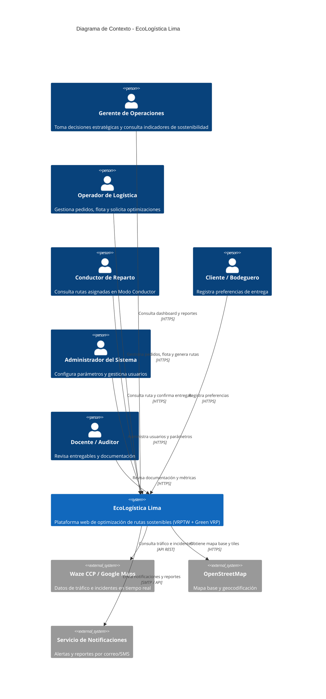
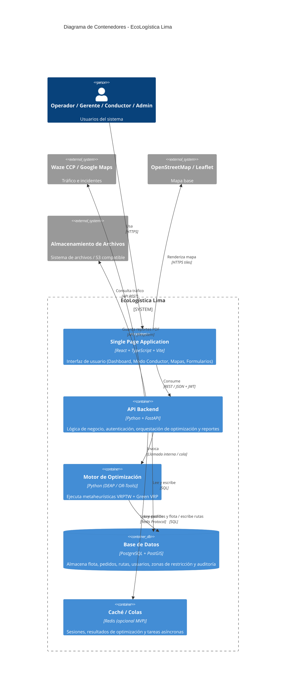
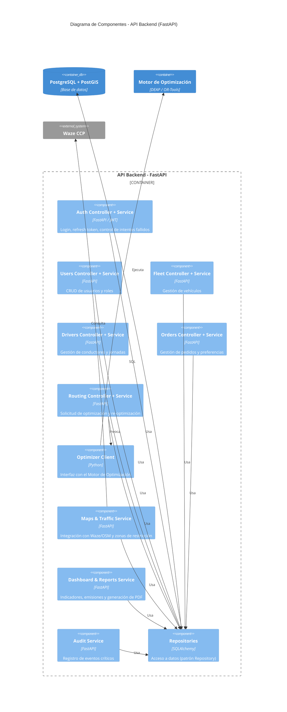

# UNIVERSIDAD CONTINENTAL
## Taller de Proyectos 2

# 12. Arquitectura de Software – Modelo C4

**Nombre del Proyecto:** EcoLogística Lima – Optimizador de Rutas Sostenibles para DistriRápido S.A.C.  
**Fecha:** 04/09/2026  
**Versión:** 1.0.0  
**Project Manager:** Carhuapoma Fano, Eilene Elizabeth  

---

## 1. Introducción

Se presenta la arquitectura del sistema EcoLogística Lima utilizando el modelo **C4** (Context, Containers, Components, Code) en sus tres primeros niveles, tal como exige la consigna de arquitectura.  
Los diagramas se generan en sintaxis **Mermaid** para garantizar trazabilidad y versionamiento en el repositorio.

---

## 2. Nivel 1 – Diagrama de Contexto (System Context)

Muestra el sistema como una caja negra y sus interacciones con los actores y sistemas externos.


---
## 3. Nivel 2 – Diagrama de Contenedores (Containers)
Descompone el sistema en contenedores desplegables (aplicaciones, bases de datos, servicios).


#### Descripción del Nivel 2

| Componente | Tecnología | Responsabilidad principal |
|------------|-----------|--------------------------|
| SPA | React + TypeScript + Vite | Toda la experiencia de usuario |
| API Backend | FastAPI | Autenticación, CRUD, orquestación, generación de reportes |
| Motor de Optimización | Python + DEAP / OR-Tools | Cálculo de rutas (proceso intensivo en CPU) |
| Base de Datos | PostgreSQL + PostGIS | Persistencia transaccional y geoespacial |
| Caché / Colas | Redis (opcional en MVP) | Sesiones y desacople del motor de optimización |

---

## 4. Nivel 3 – Diagrama de Componentes (API Backend)


#### Descripción de Componentes principales

| Componente | Responsabilidad |
|------------|----------------|
| Auth Controller + Service | Autenticación JWT, bloqueo por intentos fallidos (RN-019) |
| Fleet / Drivers / Orders | CRUD completo de las entidades de negocio |
| Routing Controller | Orquesta la generación y re-optimización de rutas |
| Optimizer Client | Desacopla la API del motor de cálculo intensivo |
| Maps & Traffic Service | Integra datos de tráfico y valida zonas restringidas |
| Dashboard & Reports Service | Calcula indicadores y genera PDFs de sostenibilidad |
| Audit Service | Cumple RNF-010 y Ley N° 29733 |
| Repositories | Única capa de acceso a datos (SQLAlchemy) |

## 5. Decisiones Arquitectónicas Relevantes
1. Separación del Motor de Optimización
Se ejecuta como proceso independiente (o worker) para no bloquear la API y cumplir los SLAs de ≤ 45 s / ≤ 30 s.
2. API Gateway implícito
FastAPI actúa como único punto de entrada. Toda autenticación y autorización se resuelve en la capa de Auth.
3. Base de datos única
PostgreSQL + PostGIS cubre tanto datos transaccionales como geoespaciales, evitando la complejidad de un polyglot persistence en el MVP.
4. Frontend desacoplado
La SPA consume únicamente la API REST documentada (OpenAPI). Permite evolución independiente y facilita el “Modo Conductor” liviano.
5. Principio de mínimo privilegio
Cada componente solo accede a los repositorios que necesita. El control de acceso fino se implementa en los servicios según la matriz RBAC del documento 08.
6. Observabilidad básica
Health checks, logs estructurados y tabla de auditoría permiten cumplir RNF-006 y RNF-010 desde la Iteración 2.

## 6. Vista de Despliegue (resumen)
````mermaid
flowchart TB
    subgraph Cloud["Cloud Provider (Railway / Render / AWS)"]
        SPA["SPA React<br/>Estáticos + CDN"]
        API["API FastAPI<br/>Contenedor Docker"]
        OPT["Motor Optimización<br/>Worker"]
        DB["PostgreSQL + PostGIS"]
        REDIS["Redis (opcional)"]
    end

    Usuario["Usuarios"] -->|HTTPS| SPA
    SPA -->|REST/JWT| API
    API --> OPT
    API --> DB
    API --> REDIS
    OPT --> DB
````
