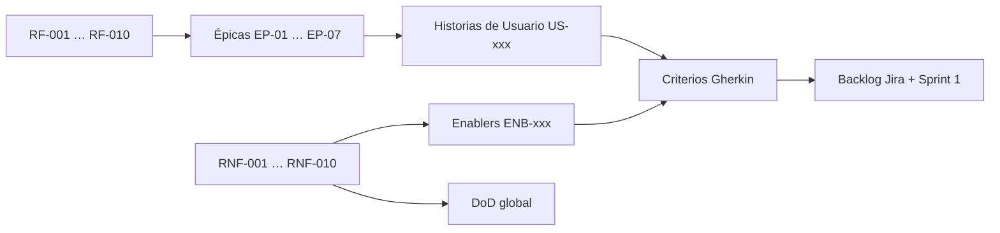

[← Volver al README Principal](../../README.md)

# UNIVERSIDAD CONTINENTAL
## Taller de Proyectos 2 — Escuela Profesional de Ingeniería de Sistemas e Informática

# 01. Transformando a Ágil

**Nombre del Proyecto:** EcoLogística Lima – Optimizador de Rutas Sostenibles para DistriRápido S.A.C.  
**Fecha:** 11/09/2026  
**Versión:** 1.0.0  
**Project Manager:** Carhuapoma Fano, Eilene Elizabeth

---

## 1. Propósito

Este artefacto transforma la línea base de requisitos de la Fase 01 (RF-001 a RF-010 y RNF-001 a RNF-010) en trabajo ágil: **Épicas → Historias de Usuario / Enablers → Criterios de Aceptación BDD**. El backlog resultante alimenta Jira Software ([artefacto 02](./02%20Artefactos%20Jira%20V_1_0_0.md)) y se estima en Story Points Fibonacci.

No se reescriben los requisitos: se descomponen. Cualquier omisión detectada se registra en el historial de control de cambios.

---

## 2. Metodología de Transformación

1. **Requisitos Funcionales (RF)** → se agrupan en **Épicas** (módulos de valor) y se descomponen en **Historias de Usuario (US)** con plantilla *Como / quiero / para*.
2. **Requisitos No Funcionales (RNF)** → se convierten en **Historias Técnicas (Enablers)** de infraestructura, arquitectura, seguridad o rendimiento, o se incrustan como criterios transversales del Definition of Done.
3. Toda US y todo Enabler incluye **al menos dos** escenarios Gherkin (`Dado / Cuando / Entonces`).
4. La estimación usa la secuencia **1, 2, 3, 5, 8, 13**. Un ítem de 13 se parte antes del segundo sprint en el que se arrastre.
5. La priorización combina valor de negocio (operación de DistriRápido) y riesgo técnico (RSK-03, RSK-05).

---

## 3. Matriz de Trazabilidad RF / RNF → Épicas → US / Enablers

| Origen | Épica | Ítems ágiles | Prioridad MoSCoW | Iteración / Sprints |
|---|---|---|---|---|
| Transversal (auth, RN-019, RN-020) | EP-01 Identidad, acceso y cumplimiento | US-001, US-002, US-003 | Must | Sprint 1–2 |
| RF-001 | EP-02 Gestión de flota | US-004, US-005 | Must | Sprint 1–2 |
| RF-008 | EP-03 Gestión de conductores y jornadas | US-006, US-007 | Must | Sprint 2 |
| RF-002, RF-009 | EP-04 Pedidos y preferencias de clientes | US-008, US-009 | Must / Could | Sprint 2–3 / Sprint 5 |
| RF-003, RF-007 | EP-05 Optimización y re-optimización | US-010, US-011 | Must / Should | Sprint 3–4 / Sprint 6 |
| RF-004 | EP-06 Visualización geoespacial | US-012, US-013 | Must | Sprint 4–5 |
| RF-005, RF-006, RF-010 | EP-07 Sostenibilidad, dashboard y reportes | US-014, US-015, US-016, US-017, US-018 | Should / Could | Sprint 5–7 |
| RNF-001, RNF-008 | ENB-001 Motor y factibilidad | ENB-001 | Must | Sprint 3–6 |
| RNF-007, CI | ENB-002 Pipeline CI/CD y análisis estático | ENB-002 | Must | Sprint 1 |
| Documento 11 | ENB-003 Esquema PostgreSQL + PostGIS | ENB-003 | Must | Sprint 1 |
| RNF-002, RNF-010 | ENB-004 Hardening OWASP y auditoría | ENB-004 | Must | Sprint 1–7 (transversal) |
| RNF-003 | ENB-005 Accesibilidad WCAG 2.1 AA | ENB-005 | Must | Sprint 5 |
| Arquitectura C4 | ENB-006 Worker y cola de optimización | ENB-006 | Must | Sprint 3 |
| RNF-007 | ENB-007 OpenAPI / Swagger vivo | ENB-007 | Must | Sprint 1–7 (DoD) |
| RNF-005, RNF-009 | ENB-008 Payload liviano 2G/3G | ENB-008 | Should | Sprint 5 |

El Acta de Constitución citaba RF-01 a RF-07 como núcleo del 70 % de aceptación. Este backlog incorpora además RF-008, RF-009 y RF-010 elicitados en el documento 06; no se altera el Acta (el umbral del 70 % sigue siendo alcanzable con Must).

---

## 4. Catálogo de Épicas

| ID | Épica | Objetivo de negocio | Lead |
|---|---|---|---|
| EP-01 | Identidad, acceso y cumplimiento | Que cada actor opere con el mínimo privilegio y con consentimiento Ley N.º 29733. | Eilene / Axel |
| EP-02 | Gestión de flota | Registrar y mantener las 15 camionetas con consumo y factor de CO₂. | Axel / Brayan |
| EP-03 | Gestión de conductores y jornadas | Asignar conductores respetando 8 h y descansos (Ley N.º 30224). | Axel / Brayan |
| EP-04 | Pedidos y preferencias de clientes | Capturar entregas con ventanas de tiempo y puntos de referencia de Lima Este. | Katheryn / Brayan |
| EP-05 | Optimización y re-optimización de rutas | Calcular VRPTW + Green VRP en ≤ 45 s y reaccionar a incidentes en ≤ 30 s. | Jorge |
| EP-06 | Visualización geoespacial | Mostrar rutas, congestión y zonas de riesgo sobre OSM. | Katheryn |
| EP-07 | Sostenibilidad, dashboard y reportes | Traducir km y CO₂ a soles, árboles y PDF para el Gerente de Operaciones. | Katheryn / Jorge |

---

## 5. Definition of Done (DoD) Global del Proyecto

Una Historia de Usuario o Enabler solo puede moverse a **Done** si cumple **todos** los criterios siguientes. El DoD es único para el producto; no se negocia por sprint.

| # | Criterio | Métrica / evidencia |
|---|---|---|
| D1 | Cobertura de pruebas unitarias | ≥ **80 %** en el paquete modificado (Pytest / frontend tests). Reporte de CI adjunto al PR. |
| D2 | Análisis estático sin vulnerabilidades críticas | **SonarQube o CodeQL** en GitHub Actions: 0 *bugs/vulnerabilities* de severidad Critical. Quality Gate en verde. |
| D3 | Revisión de código | *Peer Review* aprobada por **al menos un par técnico** distinto al autor, mediante Pull Request en GitHub. |
| D4 | Despliegue automatizado | Pipeline ejecuta build + tests + deploy a **Staging**. La US es demostrable en Staging, no solo en local. |
| D5 | Contrato de API actualizado | Esquema **OpenAPI/Swagger** regenerado (FastAPI) y revisado si la US altera endpoints. |
| D6 | Criterios Gherkin en verde | Los escenarios de la US/Enabler están automatizados o ejecutados en QA y registrados en el PR. |
| D7 | Trazabilidad | La tarjeta Jira enlaza RF/RNF/RN y el PR. No se cierra una US huérfana. |
| D8 | Accesibilidad e idioma | Textos en **español peruano**. Si hay UI, no se introducen regresiones WCAG 2.1 AA evidentes (contraste, labels, foco). |
| D9 | Seguridad mínima | Sin secretos en el repo, JWT en endpoints protegidos, logs de acciones críticas (RNF-010) cuando aplique. |

**Definition of Ready (DoR)** — condición para entrar a Sprint Planning:

- US con plantilla Completa, 2+ Gherkin, SP asignado y dependencias explícitas.
- Enabler con hipótesis técnica y criterio de salida medible.
- Diseño de BD o contrato API identificado si toca persistencia.

---

## 6. Historias de Usuario

### EP-01 — Identidad, acceso y cumplimiento

#### US-001 Autenticación con JWT

**ID:** US-001  
**Título:** Iniciar sesión con correo institucional y token JWT  
**Épica Relacionada:** EP-01 Identidad, acceso y cumplimiento  
**SP:** 5 · **MoSCoW:** Must · **Sprint objetivo:** 1  
**RF/RNF:** Transversal, RNF-002  

**Redacción:**  
Como Administrador, Gerente, Operador o Conductor,  
quiero autenticarme con correo y contraseña y recibir un JWT,  
para acceder solo a las funciones de mi rol y dejar rastro de auditoría.

**Criterios de Aceptación**

Escenario: Login exitoso de Operador  
Dado que existe un usuario con rol OPERADOR en estado ACTIVO  
Cuando envía credenciales válidas a `POST /auth/login`  
Entonces el sistema responde 200, entrega access token JWT y registra el evento `login` en `log_auditoria`.

Escenario: Credencial inválida  
Dado que el correo existe pero la contraseña es incorrecta  
Cuando se intenta el login  
Entonces el sistema responde 401, incrementa `intentos_fallidos` y no emite token.

---

#### US-002 Administración de usuarios y roles RBAC

**ID:** US-002  
**Título:** Gestionar usuarios y roles del sistema  
**Épica Relacionada:** EP-01 Identidad, acceso y cumplimiento  
**SP:** 5 · **MoSCoW:** Must · **Sprint objetivo:** 2  
**RF/RNF:** Documento 08 (matriz RBAC), RNF-002  

**Redacción:**  
Como Administrador del Sistema,  
quiero crear, desactivar y cambiar roles de usuarios,  
para aplicar el principio de mínimo privilegio sobre flota, pedidos y reportes.

**Criterios de Aceptación**

Escenario: Alta de Conductor  
Dado que un Administrador autenticado abre el módulo de usuarios  
Cuando registra email, rol CONDUCTOR y estado ACTIVO  
Entonces el sistema persiste el usuario y el nuevo rol solo ve el Modo Conductor.

Escenario: Operador no crea administradores  
Dado que el actor autenticado tiene rol OPERADOR  
Cuando intenta `POST /usuarios` con rol ADMIN  
Entonces el sistema responde 403 y no crea el registro.

---

#### US-003 Consentimiento y bloqueo por intentos fallidos

**ID:** US-003  
**Título:** Bloquear cuenta y exigir consentimiento Ley N.º 29733  
**Épica Relacionada:** EP-01 Identidad, acceso y cumplimiento  
**SP:** 3 · **MoSCoW:** Must · **Sprint objetivo:** 2  
**RF/RNF:** RN-019, RN-020, RNF-002, RNF-010  

**Redacción:**  
Como Administrador del Sistema,  
quiero bloquear cuentas tras 3 fallos y no persistir datos personales sin consentimiento,  
para cumplir la Ley N.º 29733 y reducir abuso de autenticación.

**Criterios de Aceptación**

Escenario: Bloqueo temporal  
Dado que un usuario acumula 3 intentos fallidos consecutivos  
Cuando ocurre el tercer fallo  
Entonces el estado pasa a BLOQUEADO, `bloqueado_hasta` = ahora + 15 minutos y el siguiente login responde 423.

Escenario: Pedido sin consentimiento  
Dado un cliente con `consentimiento_datos = false`  
Cuando el Operador intenta registrar un pedido para ese cliente  
Entonces el sistema rechaza la operación y solicita el consentimiento explícito.

---

### EP-02 — Gestión de flota

#### US-004 Registrar vehículo de la flota

**ID:** US-004  
**Título:** Registrar vehículo con placa, capacidad y factor de CO₂  
**Épica Relacionada:** EP-02 Gestión de flota  
**SP:** 5 · **MoSCoW:** Must · **Sprint objetivo:** 1  
**RF/RNF:** RF-001, RN-001, RN-002, RN-003  

**Redacción:**  
Como Operador de Logística,  
quiero registrar un vehículo con placa, tipo, capacidad, consumo y factor de emisión,  
para disponer de flota válida al momento de optimizar rutas.

**Criterios de Aceptación**

Escenario: Alta exitosa  
Dado que el usuario autenticado tiene rol Administrador u Operador  
Cuando registra un vehículo con placa, tipo, capacidad_kg > 0, consumo_km_l > 0, factor_emision_co2 > 0 y año de fabricación válido  
Entonces el sistema almacena el registro, asigna UUID y responde con mensaje de éxito.

Escenario: Placa duplicada o capacidad inválida  
Dado que la placa ya existe o la capacidad es negativa  
Cuando se envía el formulario  
Entonces el sistema rechaza la operación y muestra “La placa ya se encuentra registrada” o “Datos de capacidad inválidos”.

---

#### US-005 Consultar y actualizar estado de la flota

**ID:** US-005  
**Título:** Listar flota y cambiar estado o factor de emisión  
**Épica Relacionada:** EP-02 Gestión de flota  
**SP:** 3 · **MoSCoW:** Must · **Sprint objetivo:** 2  
**RF/RNF:** RF-001  

**Redacción:**  
Como Gerente de Operaciones,  
quiero consultar la flota y actualizar estado o factor de CO₂,  
para retirar unidades en mantenimiento y mantener indicadores de sostenibilidad.

**Criterios de Aceptación**

Escenario: Actualización auditada  
Dado que el vehículo ya existe  
Cuando el usuario actualiza el factor de emisión o el estado (ACTIVO / MANTENIMIENTO / INACTIVO)  
Entonces el sistema guarda los cambios y registra la modificación en `log_auditoria`.

Escenario: Conductor no edita flota  
Dado un usuario con rol CONDUCTOR  
Cuando solicita `PUT /vehiculos/{id}`  
Entonces el sistema responde 403 y el registro permanece igual.

---

### EP-03 — Gestión de conductores y jornadas

#### US-006 Registrar conductor y punto de partida

**ID:** US-006  
**Título:** Registrar conductor con DNI, licencia y punto de partida  
**Épica Relacionada:** EP-03 Gestión de conductores y jornadas  
**SP:** 5 · **MoSCoW:** Must · **Sprint objetivo:** 2  
**RF/RNF:** RF-008, RN-010  

**Redacción:**  
Como Operador de Logística,  
quiero registrar conductores con DNI, licencia, disponibilidad y coordenadas de partida,  
para que el ruteo no asuma que todos salen del depósito de SJL.

**Criterios de Aceptación**

Escenario: Alta con punto de partida  
Dado un Administrador u Operador autenticado  
Cuando registra nombre, DNI único, licencia, disponibilidad_inicio < disponibilidad_fin y lat/lon de partida  
Entonces el sistema persiste el conductor en estado ACTIVO.

Escenario: DNI duplicado  
Dado un DNI ya registrado  
Cuando se intenta un nuevo alta  
Entonces el sistema rechaza con error de unicidad y no crea el registro.

---

#### US-007 Validar jornada máxima y descansos

**ID:** US-007  
**Título:** Impedir asignaciones que violen la jornada de 8 horas  
**Épica Relacionada:** EP-03 Gestión de conductores y jornadas  
**SP:** 5 · **MoSCoW:** Must · **Sprint objetivo:** 3  
**RF/RNF:** RF-008, RN-007, RN-008, RNF-010  

**Redacción:**  
Como Operador de Logística,  
quiero que el sistema rechace rutas cuya conducción exceda 8 horas o carezca de descanso,  
para cumplir la Ley N.º 30224 y no exponer a los conductores a fatiga.

**Criterios de Aceptación**

Escenario: Rechazo por jornada excesiva  
Dado un conductor cuya suma de tramos superaría 8 horas  
Cuando se confirma la asignación de la ruta  
Entonces el sistema rechaza y muestra incumplimiento de la Ley N.º 30224.

Escenario: Descanso obligatorio  
Dado un tramo continuo de 4 horas de conducción  
Cuando se genera o confirma la ruta  
Entonces el sistema inserta un descanso mínimo de 1 hora o rechaza la solución.

---

### EP-04 — Pedidos y preferencias de clientes

#### US-008 Registrar pedido con ventana de tiempo y georreferencia

**ID:** US-008  
**Título:** Registrar pedido de entrega en Lima Este  
**Épica Relacionada:** EP-04 Pedidos y preferencias de clientes  
**SP:** 8 · **MoSCoW:** Must · **Sprint objetivo:** 2–3  
**RF/RNF:** RF-002, RN-004, RN-005  

**Redacción:**  
Como Operador de Logística,  
quiero registrar pedidos con cliente, peso, ventana de tiempo y punto de referencia o GPS,  
para alimentar el motor de ruteo aunque la dirección de SJL no tenga nomenclatura estándar.

**Criterios de Aceptación**

Escenario: Alta en cobertura  
Dado un Operador autenticado y un cliente con consentimiento  
Cuando registra ID de cliente, coordenadas dentro de SJL/El Agustino/Santa Anita/Ate, peso > 0, ventana_inicio < ventana_fin y prioridad  
Entonces el pedido queda en estado PENDIENTE.

Escenario: Georreferencia aproximada  
Dado que la dirección no es estándar  
Cuando el Operador ingresa el punto de referencia “frente a la bodega El Ahorro” y coordenadas aproximadas  
Entonces el sistema acepta el pedido y marca `georreferencia_aproximada = true`.

Escenario: Fuera de cobertura o ventana inválida  
Dado coordenadas fuera del área o ventana_inicio ≥ ventana_fin  
Cuando se intenta guardar  
Entonces el sistema rechaza y no crea el pedido.

---

#### US-009 Preferencias de horario del cliente

**ID:** US-009  
**Título:** Registrar preferencias de entrega del bodeguero  
**Épica Relacionada:** EP-04 Pedidos y preferencias de clientes  
**SP:** 5 · **MoSCoW:** Could · **Sprint objetivo:** 5  
**RF/RNF:** RF-009  

**Redacción:**  
Como Cliente (bodeguero) o como Operador en su nombre,  
quiero guardar horarios preferidos y restricciones de acceso,  
para que el algoritmo trate esas ventanas como restricción suave.

**Criterios de Aceptación**

Escenario: Preferencia válida  
Dado acceso a la ficha del cliente  
Cuando se registran hora_inicio < hora_fin, punto de referencia y restricción de acceso  
Entonces el sistema persiste la preferencia y queda disponible para US-010.

Escenario: Horarios contradictorios  
Dado hora_inicio ≥ hora_fin  
Cuando se intenta guardar  
Entonces el sistema rechaza y solicita corrección.

---

### EP-05 — Optimización y re-optimización

#### US-010 Generar rutas optimizadas VRPTW + Green VRP

**ID:** US-010  
**Título:** Calcular rutas del día para hasta 150 pedidos y 15 vehículos  
**Épica Relacionada:** EP-05 Optimización y re-optimización de rutas  
**SP:** 13 · **MoSCoW:** Must · **Sprint objetivo:** 3–4  
**RF/RNF:** RF-003, RN-006, RN-009, RN-011, RN-014, RNF-001, RNF-008  

**Redacción:**  
Como Operador de Logística,  
quiero generar un conjunto de rutas que minimice distancia, combustible, CO₂ y penalizaciones de ventana,  
para salir a repartir con un plan factible en menos de 45 segundos.

**Criterios de Aceptación**

Escenario: Solución factible a tiempo  
Dado pedidos PENDIENTE y vehículos/conductores ACTIVO  
Cuando el Operador solicita la generación de rutas  
Entonces el sistema ejecuta la metaheurística, devuelve rutas válidas en ≤ 45 s (P95, ≤ 150 pedidos / 15 vehículos) y las deja en estado BORRADOR para confirmación.

Escenario: Pico y placa y tráfico  
Dado que aplica el D.S. N.º 033-2012-MTC o hay overlay de congestión  
Cuando se genera la ruta  
Entonces se excluyen vehículos restringidos ese día y se ajustan tiempos de viaje.

Escenario: Sin factible  
Dado que no hay flota disponible o se agota el tiempo límite  
Cuando se solicita la optimización  
Entonces el sistema notifica el fallo, conserva el estado anterior y sugiere agregar vehículos o relajar ventanas.

---

#### US-011 Re-optimizar rutas ante incidentes

**ID:** US-011  
**Título:** Recalcular solo las rutas afectadas por un evento  
**Épica Relacionada:** EP-05 Optimización y re-optimización de rutas  
**SP:** 8 · **MoSCoW:** Should · **Sprint objetivo:** 6  
**RF/RNF:** RF-007, RN-015, RNF-001  

**Redacción:**  
Como Operador de Logística,  
quiero re-optimizar cuando entra un pedido, se cancela uno, hay accidente o se avería un vehículo,  
para no rehacer toda la operación del día y notificar solo a los conductores impactados.

**Criterios de Aceptación**

Escenario: Re-opt a tiempo  
Dado un evento que invalida rutas CONFIRMADA o EN_EJECUCION  
Cuando el sistema detecta el evento o el Operador lo confirma  
Entonces re-optimiza las rutas afectadas en ≤ 30 s (P95) y notifica a los conductores involucrados.

Escenario: Sin solución factible  
Dado que no hay solución dentro del tiempo límite  
Cuando se intenta re-optimizar  
Entonces se mantienen las rutas anteriores, se notifica el fallo y se registra el evento para revisión manual.

---

### EP-06 — Visualización geoespacial

#### US-012 Visualizar ruta en mapa interactivo

**ID:** US-012  
**Título:** Ver trazado, paradas y congestión en Leaflet/OSM  
**Épica Relacionada:** EP-06 Visualización geoespacial  
**SP:** 8 · **MoSCoW:** Must · **Sprint objetivo:** 4–5  
**RF/RNF:** RF-004  

**Redacción:**  
Como Operador o Gerente,  
quiero ver la ruta sobre un mapa con ETA por parada y semáforo de congestión,  
para validar el plan antes de despachar y explicar desvíos.

**Criterios de Aceptación**

Escenario: Render de ruta  
Dado que existen rutas generadas  
Cuando el usuario selecciona una ruta  
Entonces el sistema dibuja el trazado, los puntos de entrega, el ETA por tramo y el nivel verde/amarillo/rojo.

Escenario: Mapa no disponible  
Dado que el servicio de tiles OSM falla  
Cuando se intenta visualizar  
Entonces se muestra error y una vista tabular de la secuencia de entregas.

---

#### US-013 Marcar zonas de riesgo y alternativas

**ID:** US-013  
**Título:** Identificar zonas de alto riesgo y pedir ruta alternativa  
**Épica Relacionada:** EP-06 Visualización geoespacial  
**SP:** 5 · **MoSCoW:** Should · **Sprint objetivo:** 5  
**RF/RNF:** RF-004, RN-012, RN-013  

**Redacción:**  
Como Operador de Logística,  
quiero ver zonas de robo y reservas ecológicas sobre el mapa y solicitar una alternativa,  
para no exponer conductores ni cruzar áreas protegidas.

**Criterios de Aceptación**

Escenario: Overlay de riesgo  
Dado que existen `zona_restriccion` activas  
Cuando se visualiza la ruta  
Entonces el mapa marca las zonas y ofrece acción “ruta alternativa más segura”.

Escenario: Reserva ecológica como dura  
Dado un polígono tipo RESERVA_ECOLOGICA  
Cuando el algoritmo o el Operador confirma una ruta que lo intersecta  
Entonces el sistema la rechaza (RN-013).

---

### EP-07 — Sostenibilidad, dashboard y reportes

#### US-014 Dashboard de indicadores de sostenibilidad

**ID:** US-014  
**Título:** Consultar km, CO₂, combustible, cumplimiento y soles ahorrados  
**Épica Relacionada:** EP-07 Sostenibilidad, dashboard y reportes  
**SP:** 8 · **MoSCoW:** Should · **Sprint objetivo:** 5  
**RF/RNF:** RF-005, RN-016, RN-017, RN-018  

**Redacción:**  
Como Gerente de Operaciones,  
quiero un dashboard con CO₂, combustible, % de ventanas cumplidas y equivalentes en árboles,  
para decidir con números locales (S/ 17.50/galón, S/ 1.20/km) y no con intuición.

**Criterios de Aceptación**

Escenario: Dashboard con datos  
Dado un Gerente u Operador autenticado y rutas del día  
Cuando abre el dashboard  
Entonces ve km, kg CO₂, litros, %, soles ahorrados y equivalentes en árboles.

Escenario: Sin operación  
Dado que no hay rutas en el período  
Cuando consulta el dashboard  
Entonces los valores se muestran en cero con el mensaje “Sin datos de operación para el período seleccionado”.

---

#### US-015 Modo conductor simplificado

**ID:** US-015  
**Título:** Consultar ruta asignada en modo conductor  
**Épica Relacionada:** EP-07 Sostenibilidad, dashboard y reportes  
**SP:** 8 · **MoSCoW:** Should · **Sprint objetivo:** 5–6  
**RF/RNF:** RF-005, RNF-003, RNF-005, RNF-009  

**Redacción:**  
Como Conductor de Reparto,  
quiero ver solo mi ruta, la siguiente entrega y alertas, con iconos grandes y poco texto,  
para usarlo en el celular con 3G y sin entrenamiento largo.

**Criterios de Aceptación**

Escenario: Vista mínima  
Dado un Conductor autenticado con ruta asignada  
Cuando entra al Modo Conductor  
Entonces solo ve secuencia de entregas, ETA, alertas y acción de confirmar, sin dashboard gerencial.

Escenario: Carga en 3G  
Dado un perfil de red 3G simulado  
Cuando carga la vista  
Entonces el payload de la sesión es ≤ 150 KB y el tiempo de carga es ≤ 5 s.

---

#### US-016 Reporte PDF de sostenibilidad

**ID:** US-016  
**Título:** Descargar reporte PDF del período  
**Épica Relacionada:** EP-07 Sostenibilidad, dashboard y reportes  
**SP:** 5 · **MoSCoW:** Could · **Sprint objetivo:** 6  
**RF/RNF:** RF-006  

**Redacción:**  
Como Gerente de Operaciones,  
quiero descargar un PDF con impacto ambiental y económico del período,  
para reportar a gerencia y al docente sin exportar hojas de cálculo.

**Criterios de Aceptación**

Escenario: PDF generado  
Dado datos de rutas en el período  
Cuando el usuario solicita el reporte  
Entonces se genera un PDF con emisiones, ahorro de combustible, costos locales y cumplimiento, y se ofrece la descarga.

Escenario: Período vacío  
Dado un rango sin rutas  
Cuando se solicita el reporte  
Entonces el sistema informa que no hay información y no genera archivo.

---

#### US-017 Plan de compensación de carbono

**ID:** US-017  
**Título:** Calcular árboles y proyectos locales de compensación  
**Épica Relacionada:** EP-07 Sostenibilidad, dashboard y reportes  
**SP:** 5 · **MoSCoW:** Could · **Sprint objetivo:** 7  
**RF/RNF:** RF-010, RN-018  

**Redacción:**  
Como Gerente de Operaciones,  
quiero estimar cuántos árboles y qué proyectos locales compensan el CO₂ del período,  
para avanzar hacia la meta de carbono neutral en tres años.

**Criterios de Aceptación**

Escenario: Cálculo con datos  
Dado emisiones del período  
Cuando solicita el plan de compensación  
Entonces el sistema calcula CO₂ emitido, árboles equivalentes y sugiere Lomas de Lima, Parque Zonal Huáscar o “Árboles para Lima”.

Escenario: Sin emisiones  
Dado que no hay datos  
Cuando solicita el plan  
Entonces informa que no es posible calcular la compensación.

---

#### US-018 Confirmar entrega en campo

**ID:** US-018  
**Título:** Marcar entrega realizada o fallida  
**Épica Relacionada:** EP-07 Sostenibilidad, dashboard y reportes  
**SP:** 3 · **MoSCoW:** Should · **Sprint objetivo:** 6  
**RF/RNF:** RF-004 (secuencia), documento 08 U-04  

**Redacción:**  
Como Conductor de Reparto,  
quiero confirmar cada parada como ENTREGADO o FALLIDO,  
para que el dashboard de cumplimiento y el re-ruteo usen el estado real.

**Criterios de Aceptación**

Escenario: Entrega OK  
Dado un detalle de ruta PENDIENTE asignado al conductor  
Cuando confirma ENTREGADO  
Entonces el detalle y, si corresponde, el pedido pasan a ENTREGADO y se audita la acción.

Escenario: Entrega de otro conductor  
Dado un pedido asignado a otro conductor  
Cuando se intenta confirmar  
Entonces el sistema responde 403.

---

## 7. Historias Técnicas (Enablers)

Cada Enabler sigue la misma disciplina BDD. No entregan UI de negocio, pero desbloquean US de valor.

#### ENB-001 Motor metaheurístico con SLA

**ID:** ENB-001 · **SP:** 13 · **Sprint:** 3–4 · **RNF-001, RNF-008**  
Como equipo de arquitectura, quiero un worker que ejecute GA/Tabú/ACO sobre el modelo VRPTW+Green VRP, para cumplir ≤ 45 s y 100 % de soluciones factibles.

Escenario: Bench 150×15  
Dado un dataset sintético de 150 pedidos y 15 vehículos  
Cuando corre el worker en Staging  
Entonces P95 ≤ 45 s y ninguna solución viola capacidad, ventanas ni pico y placa.

Escenario: Timeout controlado  
Dado que el algoritmo no converge  
Cuando se alcanza el presupuesto de tiempo  
Entonces se devuelve la mejor factible o un error de dominio, sin colgar la API.

#### ENB-002 Pipeline CI/CD y Quality Gate

**ID:** ENB-002 · **SP:** 5 · **Sprint:** 1 · **DoD D1–D4**  
Como equipo de desarrollo, quiero GitHub Actions con tests, CodeQL/SonarQube y deploy a Staging, para no mergear código que rompa el DoD.

Escenario: PR en verde  
Dado un PR con tests pasando y sin hallazgo Critical  
Cuando el Quality Gate termina  
Entonces se habilita el merge y se despliega Staging.

Escenario: Gate rojo  
Dado cobertura < 80 % o vulnerabilidad Critical  
Cuando corre el pipeline  
Entonces el job falla y el merge queda bloqueado.

#### ENB-003 Esquema PostgreSQL + PostGIS

**ID:** ENB-003 · **SP:** 8 · **Sprint:** 1 · **Documento 11**  
Como analista de datos, quiero migraciones Alembic del modelo 3FN con PostGIS, para que flota, pedidos, zonas y auditoría existan desde el Sprint 1.

Escenario: Migración limpia  
Dado un volumen Docker vacío  
Cuando se ejecuta `alembic upgrade head`  
Entonces se crean tablas, CHECK y el índice GIST de `zona_restriccion`.

Escenario: Unicidad de placa  
Dado un vehículo persistido  
Cuando se inserta otra fila con la misma placa  
Entonces PostgreSQL rechaza por UNIQUE.

#### ENB-004 Hardening OWASP y logs

**ID:** ENB-004 · **SP:** 5 · **Sprint:** 2 (y transversal) · **RNF-002, RNF-010**  
Como Administrador, quiero headers de seguridad, TLS 1.3 en Staging, sanitización y logs de 12 meses, para no introducir hallazgos Critical.

Escenario: Inyección bloqueada  
Dado un payload con SQL o XSS en un campo de pedido  
Cuando se envía la petición  
Entonces se rechaza, no se ejecuta SQL dinámico y se registra el evento.

Escenario: Evento crítico trazable  
Dado un login o una asignación de ruta  
Cuando la acción termina  
Entonces `log_auditoria` guarda timestamp, usuario, acción e IP.

#### ENB-005 Accesibilidad WCAG 2.1 AA

**ID:** ENB-005 · **SP:** 5 · **Sprint:** 5 · **RNF-003, C-10**  
Como Conductor con baja familiaridad tecnológica, quiero contraste, labels y foco visible, para aprender la UI básica en ≤ 10 minutos.

Escenario: Contraste y nombres accesibles  
Dado el Modo Conductor  
Cuando se audita con Lighthouse o axe  
Entonces no hay violaciones AA de contraste ni controles sin nombre.

Escenario: Navegación por teclado  
Dado un usuario solo con teclado  
Cuando recorre confirmar entrega  
Entonces el foco es visible y el orden es lógico.

#### ENB-006 Worker y cola Redis

**ID:** ENB-006 · **SP:** 5 · **Sprint:** 3 · **C4 Nivel 2**  
Como Architect, quiero desacoplar la API del motor mediante cola, para no bloquear FastAPI durante los 45 s de cómputo.

Escenario: Job asíncrono  
Dado una solicitud de optimización  
Cuando la API encola el job  
Entonces responde 202 con `job_id` y el cliente consulta el resultado.

Escenario: Redis caído  
Dado Redis no disponible  
Cuando se solicita optimizar  
Entonces la API responde error controlado 503 y no deja jobs huérfanos sin registro.

#### ENB-007 OpenAPI vivo

**ID:** ENB-007 · **SP:** 3 · **Sprint:** 1 · **RNF-007, DoD D5**  
Como desarrollador frontend, quiero `/docs` Swagger generado por FastAPI, para consumir contratos reales y no capturas obsoletas.

Escenario: Docs disponibles en Staging  
Dado el contenedor API arriba  
Cuando se abre `/docs`  
Entonces se listan los endpoints publicados del sprint.

Escenario: Contrato roto  
Dado un cambio de schema sin actualizar el modelo Pydantic  
Cuando corre CI  
Entonces el test de contrato falla.

#### ENB-008 Presupuesto de datos 2G/3G

**ID:** ENB-008 · **SP:** 5 · **Sprint:** 5 · **RNF-009**  
Como Conductor en zona periférica, quiero que la sesión de ruta pese ≤ 150 KB, para no depender de Wi-Fi.

Escenario: Payload de sesión  
Dado Modo Conductor sobre una ruta de 12 paradas  
Cuando se mide la transferencia de la consulta de ruta  
Entonces el peso es ≤ 150 KB.

Escenario: Tiles diferidos  
Dado que el mapa no es crítico para la siguiente parada  
Cuando la red es 2G  
Entonces la secuencia tabular carga primero y el mapa queda opcional.

---

## 8. Backlog priorizado y estimación

Orden: valor de negocio + riesgo técnico (RSK-03 primero en cuanto exista flota y pedidos). Estimación Fibonacci. Total **156 SP**. Velocidad objetivo: **22 SP / sprint** × 7 sprints ≈ 154 SP (holgura de 2 SP).

| Orden | ID | Título | Tipo | Épica | SP | Sprint | Componente Jira |
|---|---|---|---|---|---|---|---|
| 1 | ENB-003 | Esquema PostgreSQL + PostGIS | Enabler | — | 8 | 1 | Backend / DB |
| 2 | ENB-002 | Pipeline CI/CD y Quality Gate | Enabler | — | 5 | 1 | DevOps |
| 3 | US-001 | Autenticación JWT | US | EP-01 | 5 | 1 | Backend |
| 4 | US-004 | Registrar vehículo | US | EP-02 | 5 | 1 | Backend / Frontend |
| 5 | ENB-007 | OpenAPI vivo | Enabler | — | 3 | 1 | Backend |
| 6 | US-002 | Usuarios y roles RBAC | US | EP-01 | 5 | 2 | Backend / Frontend |
| 7 | US-003 | Consentimiento y bloqueo | US | EP-01 | 3 | 2 | Backend |
| 8 | US-005 | Consultar / actualizar flota | US | EP-02 | 3 | 2 | Frontend |
| 9 | US-006 | Registrar conductor | US | EP-03 | 5 | 2 | Backend / Frontend |
| 10 | US-008 | Registrar pedido | US | EP-04 | 8 | 2–3 | Backend / Frontend |
| 11 | ENB-004 | Hardening OWASP y logs | Enabler | — | 5 | 2 | Backend |
| 12 | US-007 | Jornada y descansos | US | EP-03 | 5 | 3 | Backend |
| 13 | ENB-006 | Worker y cola Redis | Enabler | — | 5 | 3 | Backend |
| 14 | ENB-001 | Motor metaheurístico SLA | Enabler | — | 13 | 3–4 | Optimizer |
| 15 | US-010 | Generar rutas VRPTW | US | EP-05 | 13 | 3–4 | Optimizer / API |
| 16 | US-012 | Mapa Leaflet/OSM | US | EP-06 | 8 | 4–5 | Frontend |
| 17 | US-013 | Zonas de riesgo | US | EP-06 | 5 | 5 | Frontend / DB |
| 18 | US-014 | Dashboard sostenibilidad | US | EP-07 | 8 | 5 | Frontend / API |
| 19 | US-015 | Modo conductor | US | EP-07 | 8 | 5–6 | Frontend |
| 20 | ENB-005 | WCAG 2.1 AA | Enabler | — | 5 | 5 | Frontend |
| 21 | ENB-008 | Payload 2G/3G | Enabler | — | 5 | 5 | Frontend |
| 22 | US-009 | Preferencias de cliente | US | EP-04 | 5 | 5 | Frontend / API |
| 23 | US-011 | Re-optimización dinámica | US | EP-05 | 8 | 6 | Optimizer |
| 24 | US-016 | Reporte PDF | US | EP-07 | 5 | 6 | API |
| 25 | US-018 | Confirmar entrega | US | EP-07 | 3 | 6 | Frontend / API |
| 26 | US-017 | Compensación de carbono | US | EP-07 | 5 | 7 | API / Frontend |
| | | **Total** | | | **156** | | |

US-010 y ENB-001 (13 SP) se ejecutan en dos sprints consecutivos con subtareas ≤ 8 h, nunca como un único bloque sin avance demostrable.

---

## 9. Sprint 1 — planificación de referencia

**Duración:** 2 semanas (estándar de la consigna).  
**Capacidad académica:** 86 h/semana × 2 = **172 h**. Con 6–8 h/SP ≈ **21–28 SP**. Se comprometen **26 SP**.

**Sprint Goal:** Dejar operativa en Staging la plataforma base de EcoLogística Lima: esquema de datos desplegado por pipeline, autenticación JWT y registro de vehículos de la flota de DistriRápido.

| ID | SP | Responsable principal |
|---|---|---|
| ENB-003 | 8 | Leon Taza, Brayan Angel |
| ENB-002 | 5 | Estrada Flores, Axel Sebastian |
| US-001 | 5 | Estrada Flores, Axel Sebastian |
| US-004 | 5 | Huaman Baldeon, Katheryn Elena + Axel |
| ENB-007 | 3 | Cruz Salazar, Jorge Luiz |
| **Total** | **26** | |

Criterio de éxito del Sprint 1: un Operador de prueba inicia sesión en Staging, registra un vehículo con factor de CO₂ y el OpenAPI lista los endpoints; el Quality Gate está en verde.

Detalle de tablero, versión `v1.0.0-MVP` y Roadmap: [02 Artefactos Jira V_1_0_0.md](./02%20Artefactos%20Jira%20V_1_0_0.md).

---

## 10. Historial de Control de Cambios

| Versión | Fecha | Autor | Descripción |
|---|---|---|---|
| 1.0.0 | 11/09/2026 | Equipo EcoLogística Lima | Transformación inicial RF/RNF → 7 épicas, 18 US, 8 enablers, DoD global y backlog de 156 SP. |

---

[← Volver al README Principal](../../README.md)
