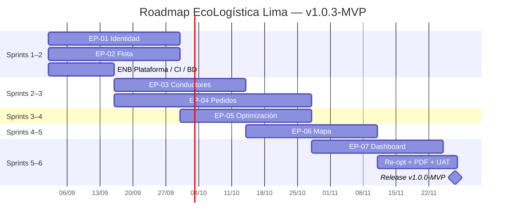
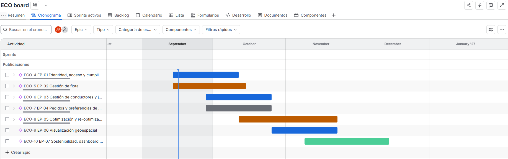
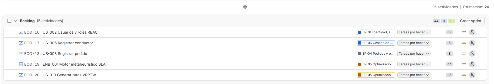
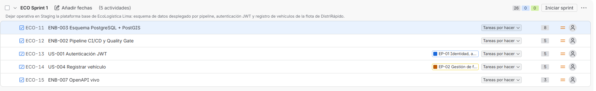
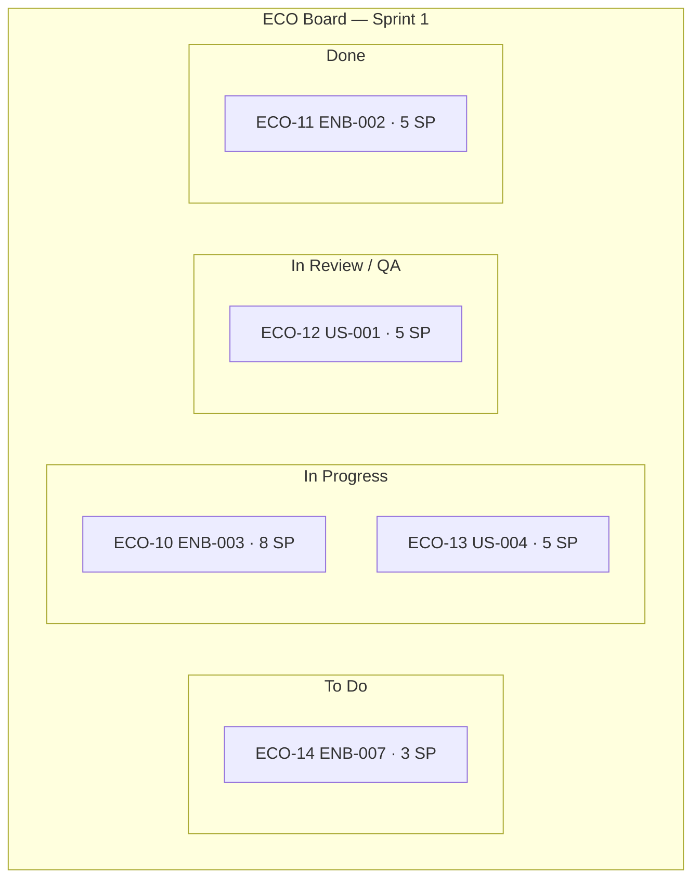
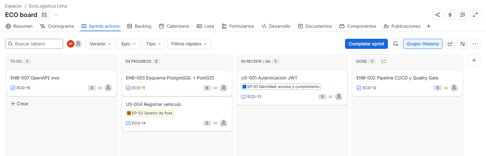
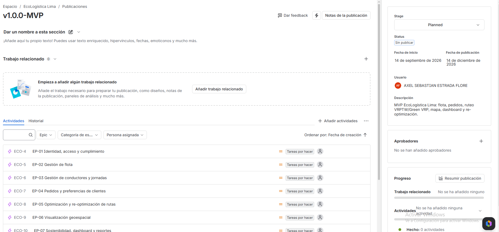

[← Volver al README Principal](../../README.md)

# UNIVERSIDAD CONTINENTAL
## Taller de Proyectos 2 — Escuela Profesional de Ingeniería de Sistemas e Informática

# 02. Artefactos Jira Software

**Nombre del Proyecto:** EcoLogística Lima – Optimizador de Rutas Sostenibles para DistriRápido S.A.C.  
**Fecha:** 11/09/2026  
**Versión:** 1.0.4  
**Project Manager:** Carhuapoma Fano, Eilene Elizabeth  
**Producto ALM:** Atlassian Jira Software Cloud  
**Clave de proyecto:** `ECO`  
**Tipo:** Company-managed Scrum  
**Release oficial:** `v1.0.3-MVP`

---

## 1. Propósito

Este documento es el informe de **parametrización** de Jira Software para el PFA: jerarquía de trabajo, backlog estimado, hoja de ruta, Sprint 1 con *Sprint Goal*, tablero Scrum y versión de entrega. El backlog fuente es [01 Transformando a ágil V_1_0_0.md](./01%20Transformando%20a%20%C3%A1gil%20V_1_0_0.md).

Las cinco evidencias fotográficas exigidas por la consigna se recortan **exclusivamente** al panel de Jira (sin escritorio, barra de tareas, pestañas del navegador ni espacio sobrante). Las capturas viven en [`evidencias/`](./evidencias/). Este informe deja lista la parametrización (claves, SP, Sprint Goal, columnas y release) para cargarla en el sitio Jira del equipo; las PNG recortadas se añaden tras crear el proyecto `ECO` con el guion de la sección 8.

---

## 2. Parametrización del proyecto

| Parámetro | Valor configurado |
|---|---|
| Nombre | EcoLogística Lima |
| Key | ECO |
| Plantilla | Scrum (company-managed) |
| Tablero | `ECO Board` — Scrum |
| Columnas | `To Do` → `In Progress` → `In Review / QA` → `Done` |
| Estimación | Story Points (secuencia 1, 2, 3, 5, 8, 13) |
| Sprint duration | 2 semanas |
| Working days | Lun–Sáb (carga académica) |
| Release | `v1.0.3-MVP` (fecha objetivo 27/11/2026, hito 4 del Acta) |
| Idioma de issues | Español peruano |
| Componentes | Backend, Frontend, Optimizer, DB, DevOps |

### 2.1 Jerarquía del trabajo

| Tipo Jira | Uso en el PFA |
|---|---|
| **Épica (Epic)** | Módulos EP-01 a EP-07. |
| **Historia de Usuario (Story)** | US-001 a US-018. Funcionalidad de usuario final. |
| **Historia Técnica (Task / Enabler)** | ENB-001 a ENB-008. Arquitectura, datos, seguridad, rendimiento. |
| **Subtarea (Sub-task)** | Unidades ≤ 8 h (migración, test, mock UI, spike). |
| **Error (Bug)** | Incidencias de Sprint Review o QA. |

### 2.2 Flujo de trabajo del tablero

Regla de columna **Done**: solo si se cumple el [DoD global](./01%20Transformando%20a%20%C3%A1gil%20V_1_0_0.md#5-definition-of-done-dod-global-del-proyecto) (cobertura ≥ 80 %, Quality Gate, PR aprobado, Staging, OpenAPI).

---

## 3. Evidencia 1 — Roadmap del proyecto

Épicas alineadas a 6 sprints de 2 semanas (02/09/2026 – 24/11/2026) más 3 días de cierre y presentación (25/11 – 27/11/2026), según el cronograma corregido del Acta.

| Épica | S1 | S2 | S3 | S4 | S5 | S6 |
|---|---|---|---|---|---|---|
| EP-01 Identidad y cumplimiento | ■ | ■ | | | | |
| EP-02 Gestión de flota | ■ | ■ | | | | |
| EP-03 Conductores y jornadas | | ■ | ■ | | | |
| EP-04 Pedidos y clientes | | ■ | ■ | | ■ | |
| EP-05 Optimización de rutas | | | ■ | ■ | | ■ |
| EP-06 Visualización geoespacial | | | | ■ | ■ | |
| EP-07 Sostenibilidad y reportes | | | | | ■ | ■ |
| Enablers de plataforma | ■ | ■ | ■ | ■ | ■ | ■ UAT |

**Captura requerida:** Timeline / Roadmap de Jira Cloud con las 7 épicas en el eje de tiempo, recorte al panel Timeline (sin chrome del SO). Archivo destino: `evidencias/evidencia-01-roadmap.png`.

---

## 4. Evidencia 2 — Backlog priorizado

Vista general con Story Points, épica, componente y responsable. El orden es el de valor + riesgo técnico.

| Key sugerido | Tipo | Resumen | Épica | SP | Assignee | Componente |
|---|---|---|---|---|---|---|
| ECO-1 | Epic | EP-01 Identidad, acceso y cumplimiento | — | — | Eilene Carhuapoma | Backend |
| ECO-2 | Epic | EP-02 Gestión de flota | — | — | Axel Estrada | Backend |
| ECO-3 | Epic | EP-03 Gestión de conductores y jornadas | — | — | Axel Estrada | Backend |
| ECO-4 | Epic | EP-04 Pedidos y preferencias de clientes | — | — | Katheryn Huaman | Frontend |
| ECO-5 | Epic | EP-05 Optimización y re-optimización de rutas | — | — | Jorge Cruz | Optimizer |
| ECO-6 | Epic | EP-06 Visualización geoespacial | — | — | Katheryn Huaman | Frontend |
| ECO-7 | Epic | EP-07 Sostenibilidad, dashboard y reportes | — | — | Katheryn Huaman | Frontend |
| ECO-10 | Task | ENB-003 Esquema PostgreSQL + PostGIS | Plataforma | 8 | Brayan Leon | DB |
| ECO-11 | Task | ENB-002 Pipeline CI/CD y Quality Gate | Plataforma | 5 | Axel Estrada | DevOps |
| ECO-12 | Story | US-001 Autenticación JWT | EP-01 | 5 | Axel Estrada | Backend |
| ECO-13 | Story | US-004 Registrar vehículo | EP-02 | 5 | Katheryn Huaman | Frontend |
| ECO-14 | Task | ENB-007 OpenAPI vivo | Plataforma | 3 | Jorge Cruz | Backend |
| ECO-15 | Story | US-002 Usuarios y roles RBAC | EP-01 | 5 | Axel Estrada | Backend |
| ECO-16 | Story | US-003 Consentimiento y bloqueo | EP-01 | 3 | Axel Estrada | Backend |
| ECO-17 | Story | US-005 Consultar / actualizar flota | EP-02 | 3 | Katheryn Huaman | Frontend |
| ECO-18 | Story | US-006 Registrar conductor | EP-03 | 5 | Brayan Leon | DB |
| ECO-19 | Story | US-008 Registrar pedido | EP-04 | 8 | Katheryn Huaman | Frontend |
| ECO-20 | Task | ENB-004 Hardening OWASP y logs | Plataforma | 5 | Axel Estrada | Backend |
| ECO-21 | Story | US-007 Jornada y descansos | EP-03 | 5 | Jorge Cruz | Backend |
| ECO-22 | Task | ENB-006 Worker y cola Redis | Plataforma | 5 | Jorge Cruz | Optimizer |
| ECO-23 | Task | ENB-001 Motor metaheurístico SLA | EP-05 | 13 | Jorge Cruz | Optimizer |
| ECO-24 | Story | US-010 Generar rutas VRPTW | EP-05 | 13 | Jorge Cruz | Optimizer |
| ECO-25 | Story | US-012 Mapa Leaflet/OSM | EP-06 | 8 | Katheryn Huaman | Frontend |
| ECO-26 | Story | US-013 Zonas de riesgo | EP-06 | 5 | Brayan Leon | DB |
| ECO-27 | Story | US-014 Dashboard sostenibilidad | EP-07 | 8 | Katheryn Huaman | Frontend |
| ECO-28 | Story | US-015 Modo conductor | EP-07 | 8 | Katheryn Huaman | Frontend |
| ECO-29 | Task | ENB-005 WCAG 2.1 AA | EP-07 | 5 | Katheryn Huaman | Frontend |
| ECO-30 | Task | ENB-008 Payload 2G/3G | EP-07 | 5 | Axel Estrada | Frontend |
| ECO-31 | Story | US-009 Preferencias de cliente | EP-04 | 5 | Katheryn Huaman | Frontend |
| ECO-32 | Story | US-011 Re-optimización dinámica | EP-05 | 8 | Jorge Cruz | Optimizer |
| ECO-33 | Story | US-016 Reporte PDF | EP-07 | 5 | Axel Estrada | Backend |
| ECO-34 | Story | US-018 Confirmar entrega | EP-07 | 3 | Katheryn Huaman | Frontend |
| ECO-35 | Story | US-017 Compensación de carbono | EP-07 | 5 | Jorge Cruz | Backend |

**Σ Story Points del backlog:** 156.

**Captura requerida:** Backlog de Scrum con SP visibles y épicas/componentes a la izquierda; recorte al listado (sin navegador).  Archivo destino: `evidencias/evidencia-02-backlog.png`.

---

## 5. Evidencia 3 — Sprint Planning y Sprint Goal

**Sprint:** `ECO Sprint 1`  
**Fechas:** 02/09/2026 – 15/09/2026 (2 semanas)  
**Capacidad:** 172 h académicas · compromiso **26 SP**

### Sprint Goal (texto a pegar en la cabecera de Jira)

> Dejar operativa en Staging la plataforma base de EcoLogística Lima: esquema de datos desplegado por pipeline, autenticación JWT y registro de vehículos de la flota de DistriRápido.

| Key | Ítem | SP | Estado inicial |
|---|---|---|---|
| ECO-10 | ENB-003 Esquema PostgreSQL + PostGIS | 8 | To Do |
| ECO-11 | ENB-002 Pipeline CI/CD y Quality Gate | 5 | To Do |
| ECO-12 | US-001 Autenticación JWT | 5 | To Do |
| ECO-13 | US-004 Registrar vehículo | 5 | To Do |
| ECO-14 | ENB-007 OpenAPI vivo | 3 | To Do |
| | **Compromiso** | **26** | |

Subtareas de ejemplo (≤ 8 h) para ECO-10: (1) extensión PostGIS, (2) tablas de seguridad, (3) tablas de flota, (4) seed de vehículos de demo.

**Captura requerida:** vista Sprint 1 con el *Sprint Goal* en la cabecera y los 5 ítems comprometidos; recorte al contenedor del sprint.  Archivo destino: `evidencias/evidencia-03-sprint-1.png`.

---

## 6. Evidencia 4 — Tablero Scrum activo

Distribución inicial del Sprint 1 (el Daily moverá tarjetas; la foto de entrega debe mostrar **las cuatro columnas pobladas**, no un tablero vacío).

| Columna | Tarjetas (estado de demo) |
|---|---|
| **To Do** | ECO-14 ENB-007 OpenAPI (3 SP) |
| **In Progress** | ECO-10 ENB-003 PostgreSQL (8 SP) · ECO-13 US-004 Vehículo (5 SP) |
| **In Review / QA** | ECO-12 US-001 JWT (5 SP) |
| **Done** | ECO-11 ENB-002 CI/CD (5 SP) — primer ítem que cierra el DoD de pipeline |

WIP sugerido: máximo 3 issues en *In Progress* (mitiga RSK-05).

**Captura requerida:** tablero con columnas `To Do`, `In Progress`, `In Review / QA`, `Done` y tarjetas en más de una columna; recorte al board.  Archivo destino: `evidencias/evidencia-04-tablero.png`.

---

## 7. Evidencia 5 — Gestión de versiones / Release

| Campo | Valor |
|---|---|
| Nombre | `v1.0.3-MVP` |
| Fecha de lanzamiento | 27/11/2026 |
| Descripción | MVP EcoLogística Lima: flota, pedidos, ruteo VRPTW/Green VRP, mapa, dashboard y re-optimización. Umbral de aceptación: ≥ 70 % de RF de prioridad Alta. |
| Issues asociados | ECO-1 a ECO-7 (épicas) y todas las Stories/Tasks Must + Should del backlog |
| Estado | Unreleased hasta el Hito 4 |

Historias **Must** de la release: US-001 a US-008, US-010, US-012 y ENB-001 a ENB-007. Las Could (US-009, US-016, US-017) permanecen en la misma versión pero son las primeras en recortarse si se materializa RSK-05.

**Captura requerida:** módulo Releases de Jira mostrando `v1.0.3-MVP` y la asociación de issues/épicas; recorte al panel de la versión.  Archivo destino: `evidencias/evidencia-05-release.png`.

---

## 8. Protocolo de captura (obligatorio)

Incumplir este protocolo resta el 50 % del puntaje de la sección, según la consigna.

1. Abrir Jira en ventana maximizada, zoom 100 %.
2. Recortar **solo** el widget: Timeline, listado de backlog, cabecera+lista del Sprint, tablero de columnas o ficha de Release.
3. Prohibido: barra de tareas, reloj, fondos de escritorio, pestaña del navegador, bookmarks, URL completa, espacio blanco masivo.
4. Exportar PNG (no JPEG) a `docs/02 Planificación/evidencias/` con los nombres de las secciones 3 a 7.
5. Verificar que se lea: nombre de épicas/issues, SP, columnas y `v1.0.2-MVP`.

Guion operativo (30–40 min) en [`evidencias/README.md`](./evidencias/README.md).

---

## 9. Trazabilidad Scrum ↔ documentación

| Artefacto Jira | Documento origen |
|---|---|
| Épicas y Stories | 01 Transformando a ágil |
| DoD para pasar a Done | 01, sección 5 |
| Riesgos que explican el orden del backlog | 03 Registro de riesgos (RSK-03, RSK-05) |
| Fecha de release | Acta de Constitución, Hito 4 |
| Componentes Backend/Frontend/Optimizer/DB | Documentos 10, 11 y 12 |

---

## 10. Historial de Control de Cambios

| Versión | Fecha | Autor | Descripción |
|---|---|---|---|
| 1.0.0 | 11/09/2026 | Equipo EcoLogística Lima | Parametrización ECO Scrum, backlog 156 SP, Sprint 1 (26 SP), release v1.0.3-MVP y protocolo de evidencias. |

---
| 1.0.2 (corrección) | 11/09/2026 | Equipo EcoLogística Lima | Roadmap y Release recalculados a 6 sprints (02/09–24/11/2026), release 27/11/2026 en vez de 14/12/2026. |

[← Volver al README Principal](../../README.md)
