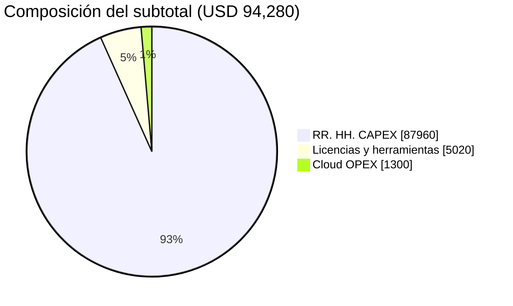

[← Volver al README Principal](../../README.md)

# UNIVERSIDAD CONTINENTAL
## Taller de Proyectos 2 — Escuela Profesional de Ingeniería de Sistemas e Informática

# 04. Presupuesto del Proyecto

**Nombre del Proyecto:** EcoLogística Lima – Optimizador de Rutas Sostenibles para DistriRápido S.A.C.  
**Fecha:** 11/09/2026  
**Versión:** 1.0.0  
**Project Manager:** Carhuapoma Fano, Eilene Elizabeth  
**Moneda de costeo:** USD  
**Tipo de cambio de referencia:** S/ 3.70 por USD (setiembre 2026)  
**Horizonte:** 14 semanas (4 meses calendario de operación del laboratorio, incluyendo buffer de cierre)

---

## 1. Propósito y premisas

Este documento modela el costo integral del PFA según la consigna de planificación: recursos humanos (CAPEX de ejecución), licenciamiento y herramientas, infraestructura cloud (OPEX) y reserva de contingencia derivada del [registro de riesgos](./03%20Registro%20de%20riesgos%20V_1_0_0.md).

### 1.1 Premisas de costeo

| Premisa | Valor | Fuente |
|---|---|---|
| Duración del MVP | 14 semanas / 4 iteraciones / 7 sprints | Acta de Constitución |
| Techo autorizado | S/ 500,000.00 (USD 135,135.14) | Acta de Constitución, C-01 |
| Reserva de contingencia | 12 % del subtotal | Consigna (rango 10–15 %) y exposición media Medium |
| Costeo de RR. HH. | Equivalencia profesional de 40 h/semana × 14 semanas por integrante (2 800 h) | Simulación comercial del PFA |
| Dedicación académica real | 86 h/semana de equipo (1 204 h) | Documento 01 — no se usa para tarifar; se usa para capacidad de sprint |
| Stack | 100 % open source en runtime (C-03) | Documento 10 |
| Jira | Cloud Standard, 5 usuarios, 4 meses | Consigna ALM |

El costeo profesional (40 h/semana) representa el **valor de mercado de entregar el MVP**, no las horas académicas disponibles. La capacidad real de sprint se gestiona en Jira con las dedicaciones del documento 01.

---

## 2. Costo de Recursos Humanos (CAPEX)

**Fórmula:** `Costo = Horas asignadas × Tarifa hora (USD)`

Mapeo de roles de la consigna hacia el equipo:

| Rol de consigna | Integrante | Lógica de asignación |
|---|---|---|
| Project Manager | Carhuapoma Fano, Eilene Elizabeth | Liderazgo, Jira, interesados, control de cambios |
| Software Architect | Cruz Salazar, Jorge Luiz | Arquitectura C4 + motor VRPTW/Green VRP |
| Senior Developer | Estrada Flores, Axel Sebastian (70 %) | Backend FastAPI, integración, CI |
| QA Engineer | Estrada Flores, Axel Sebastian (30 %) | Estrategia de pruebas, BDD, aceptación |
| UI/UX Designer | Huaman Baldeon, Katheryn Elena (36 %) | Modo conductor, WCAG 2.1 AA, mockups Figma |
| Junior Developer | Huaman Baldeon, Katheryn Elena (64 %) + Leon Taza, Brayan Angel | Frontend React y modelo de datos / PostGIS |

| Rol | Responsable | Horas | Tarifa (USD/h) | Costo (USD) | Costo (PEN) |
|---|---|---|---|---|---|
| Project Manager | Carhuapoma Fano, Eilene Elizabeth | 560 | 37.00 | 20,720.00 | 76,664.00 |
| Software Architect | Cruz Salazar, Jorge Luiz | 560 | 42.00 | 23,520.00 | 87,024.00 |
| Senior Developer | Estrada Flores, Axel Sebastian | 400 | 33.00 | 13,200.00 | 48,840.00 |
| QA Engineer | Estrada Flores, Axel Sebastian | 160 | 28.00 | 4,480.00 | 16,576.00 |
| UI/UX Designer | Huaman Baldeon, Katheryn Elena | 200 | 30.00 | 6,000.00 | 22,200.00 |
| Junior Developer (Frontend) | Huaman Baldeon, Katheryn Elena | 360 | 23.00 | 8,280.00 | 30,636.00 |
| Junior Developer (Datos) | Leon Taza, Brayan Angel | 560 | 21.00 | 11,760.00 | 43,512.00 |
| **Total RR. HH.** | | **2,800** | | **87,960.00** | **325,452.00** |

Tarifa media ponderada: USD 87,960 / 2,800 h = **USD 31.41/h** (≈ S/ 116/h), alineada a tarifas locales de un equipo mixto junior–senior en Lima para un proyecto de 14 semanas.

Control: el Acta reservó S/ 325,000 para RR. HH. Este desglose cierra en S/ 325,452 (**+0.14 %**), dentro de la variación del 10 % permitida por el objetivo SMART de costo.

---

## 3. Costo de Licenciamiento y Herramientas

| Ítem | Base de cálculo (4 meses) | USD | PEN |
|---|---|---|---|
| Jira Software Cloud Standard | 5 usuarios × USD 9.05 × 4 | 181.00 | 669.70 |
| Figma Professional | 2 editores × USD 20.00 × 4 | 160.00 | 592.00 |
| JetBrains All Products (IDE) | 5 puestos × USD 25.00 × 4 | 500.00 | 1,850.00 |
| GitHub Team | 5 usuarios × USD 4.00 × 4 | 80.00 | 296.00 |
| SonarCloud (análisis estático) | USD 10.00 × 4 | 40.00 | 148.00 |
| Docker Hub Pro | USD 11.00 × 4 | 44.00 | 162.80 |
| Dominio y DNS | 1 año prorrateado al PFA | 15.00 | 55.50 |
| **Subtotal software** | | **1,020.00** | **3,774.00** |
| Estaciones de trabajo del laboratorio | 5 laptops × USD 800.00 | 4,000.00 | 14,800.00 |
| **Total licenciamiento y herramientas** | | **5,020.00** | **18,574.00** |

No se presupuestan licencias de Google Maps ni de solvers propietarios: el stack del documento 10 usa Leaflet/OpenStreetMap, FastAPI, PostgreSQL y DEAP/OR-Tools. VS Code y GitHub Actions permanecen en el plan gratuito como respaldo si se desactiva GitHub Team.

---

## 4. Infraestructura Cloud y Servicios (OPEX)

Dimensionada para cumplir RNF-001 (worker de optimización), RNF-006 (disponibilidad ≥ 99.5 % en horario 05:00–22:00) y el almacenamiento de reportes PDF.

| Servicio | Especificación | USD/mes | 4 meses (USD) | 4 meses (PEN) |
|---|---|---|---|---|
| Compute API + SPA | Lightsail 4 GB / 2 vCPU | 40.00 | 160.00 | 592.00 |
| Worker de optimización | Lightsail 8 GB / 4 vCPU | 80.00 | 320.00 | 1,184.00 |
| Staging | Lightsail 2 GB | 20.00 | 80.00 | 296.00 |
| PostgreSQL + PostGIS gestionado | 2 GB RAM, backups diarios | 60.00 | 240.00 | 888.00 |
| Redis (sesiones y cola) | 1 GB | 15.00 | 60.00 | 222.00 |
| Object storage + CDN | Reportes PDF y estáticos | 25.00 | 100.00 | 370.00 |
| Snapshots y backups | Retención 14 días | 20.00 | 80.00 | 296.00 |
| Observabilidad | Logs y métricas | 18.00 | 72.00 | 266.40 |
| Tráfico, DNS y TLS | Let's Encrypt + egress | 12.00 | 48.00 | 177.60 |
| Cómputo extra (picos GA/ACO) | Burst del worker | 35.00 | 140.00 | 518.00 |
| **Total Cloud / OPEX** | | **325.00** | **1,300.00** | **4,810.00** |

Certificados SSL: USD 0 (Let's Encrypt). CI/CD: GitHub Actions incluido en la línea de GitHub Team. No se incluye GPU: el motor corre en CPU, coherente con C-03 y con RSK-01.

---

## 5. Reserva de Contingencia (Imprevistos)

La exposición media del registro de riesgos es **10.6 (Medium)**, con dos riesgos High (RSK-03 algoritmo y RSK-05 cronograma). Se aplica el **12 %** sugerido por la consigna sobre el subtotal.

`Reserva = 0.12 × (RR. HH. + Licencias + Cloud) = 0.12 × 94,280.00 = 11,313.60 USD`

Uso de la reserva: solo con autorización del PM y registro en el historial de control de cambios. Prioridad de consumo: RSK-03 (cómputo extra del motor) y RSK-01 (migración de nube).

---

## 6. Tabla Resumen Financiera

| Categoría | Costo Subtotal (USD) | Costo (PEN) | Porcentaje del Subtotal |
|---|---|---|---|
| 1. Recursos Humanos (CAPEX) | $ 87,960.00 | S/ 325,452.00 | 93.3 % |
| 2. Licenciamiento de Software | $ 5,020.00 | S/ 18,574.00 | 5.3 % |
| 3. Infraestructura Cloud (OPEX) | $ 1,300.00 | S/ 4,810.00 | 1.4 % |
| **SUBTOTAL DE PROYECTO** | **$ 94,280.00** | **S/ 348,836.00** | **100.0 %** |
| 4. Reserva de Contingencia (12 %) | $ 11,313.60 | S/ 41,860.32 | N/A |
| **PRESUPUESTO TOTAL ESTIMADO** | **$ 105,593.60** | **S/ 390,696.32** | **100.0 %** |

### 6.1 Reconciliación con el Acta de Constitución

| Concepto | PEN | USD |
|---|---|---|
| Techo autorizado (C-01 / Acta) | S/ 500,000.00 | $ 135,135.14 |
| Línea base de ejecución (este documento) | S/ 390,696.32 | $ 105,593.60 |
| Holgura de gestión | S/ 109,303.68 | $ 29,541.54 |
| Uso del techo | 78.1 % | 78.1 % |

La holgura no se gasta por defecto: cubre inflación de tarifas, un eventual salto a Jira Premium (Advanced Roadmaps) o un *burst* de cómputo si RSK-03 se materializa por encima de la reserva del 12 %. El objetivo SMART de costo del Acta (CPI ≥ 0.9) se controlará quincenalmente contra esta línea base de **USD 105,593.60**.

---

## 7. Justificación frente al alcance del PFA

El presupuesto se sostiene en el alcance congelado del MVP (RF-001 a RF-010, RNF-001 a RNF-010) y en estas decisiones de costo:

1. **RR. HH. es el 93.3 % del subtotal.** Es coherente con un producto de software: el valor está en diseño de algoritmo, API, datos geoespaciales y UX inclusiva, no en licencias.
2. **Open source obligatorio (C-03)** mantiene Cloud + software por debajo del 7 % del subtotal. Leaflet/OSM evita la partida de Google Maps API, que en 150 pedidos/día × 15 vehículos podría superar el OPEX aquí presupuestado.
3. **Laboratorio de 5 estaciones (USD 4,000)** se carga al PFA porque el Acta contemplaba Hardware/Software (S/ 50,000). Aquí se compra solo lo necesario; el resto del techo queda como holgura.
4. **Contingencia 12 %** está trazada a la exposición cuantitativa de riesgos, no es un porcentaje decorativo.
5. **No se duplica el costo académico y el profesional.** Las 1 204 h de dedicación real gobiernan el *sprint capacity*; las 2 800 h tarifadas gobiernan el valor económico del entregable.

### 7.1 Distribución visual

---

## 8. Flujo trimestral de caja (referencia)

| Mes | RR. HH. | Licencias (prorrateo) | Cloud | Total mes |
|---|---|---|---|---|
| Mes 1 (Sprints 1–2) | 21,990.00 | 1,255.00 | 325.00 | 23,570.00 |
| Mes 2 (Sprints 3–4) | 21,990.00 | 1,255.00 | 325.00 | 23,570.00 |
| Mes 3 (Sprints 5–6) | 21,990.00 | 1,255.00 | 325.00 | 23,570.00 |
| Mes 4 (Sprint 7 + cierre) | 21,990.00 | 1,255.00 | 325.00 | 23,570.00 |
| **Suma 4 meses** | **87,960.00** | **5,020.00** | **1,300.00** | **94,280.00** |

La reserva de USD 11,313.60 no se calendariza: permanece retenida hasta que un riesgo High o Medium se materialice.

---

## 9. Historial de Control de Cambios

| Versión | Fecha | Autor | Descripción |
|---|---|---|---|
| 1.0.0 | 11/09/2026 | Equipo EcoLogística Lima | Línea base de ejecución USD 105,593.60 (S/ 390,696.32), contingencia 12 %, reconciliación con techo del Acta S/ 500,000. |

---

[← Volver al README Principal](../../README.md)
