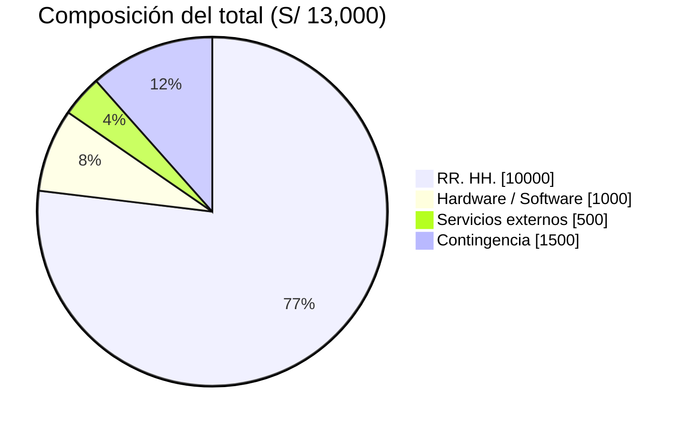

[← Volver al README Principal](../../README.md)

# UNIVERSIDAD CONTINENTAL
## Taller de Proyectos 2 — Escuela Profesional de Ingeniería de Sistemas e Informática

# 04. Presupuesto del Proyecto

**Nombre del Proyecto:** EcoLogística Lima – Optimizador de Rutas Sostenibles para DistriRápido S.A.C.  
**Fecha:** 25/09/2026  
**Versión:** 1.0.2  
**Project Manager:** Carhuapoma Fano, Eilene Elizabeth  
**Moneda de costeo:** PEN (soles)  
**Horizonte:** 12.4 semanas (6 sprints + 3 días de cierre), 02/09/2026 – 27/11/2026.

---

## 1. Propósito y premisas

Este documento desglosa el presupuesto académico del PFA alineado al [Acta de Constitución](../01%20Inicio/02.%20Acta%20de%20constituci%C3%B3n%20V_1_0_5.md): recursos humanos, hardware/software, servicios externos (cloud) y reserva de contingencia derivada del [registro de riesgos](./03%20Registro%20de%20riesgos%20V_1_0_4.md).

Todas las cifras están en **soles**. El techo original de la consigna (S/ 500,000) se conserva como referencia; la línea base de ejecución es el rebaseline del Acta: **S/ 13,000**.

### 1.1 Premisas de costeo

| Premisa | Valor | Fuente |
|---|---|---|
| Duración del MVP | 12.4 semanas / 6 sprints + cierre | Acta de Constitución |
| Costeo de RR. HH. | S/ 2,000 por integrante para **todo** el proyecto (5 personas) | Acuerdo del equipo / Acta §6 |
| Hardware / Software | ≈ S/ 1,000 | Acta §6 |
| Servicios externos | S/ 500 | Acta §6 |
| Contingencia | S/ 1,500 (13 % del subtotal) | Acta §6 y exposición media Medium del registro de riesgos |
| ALM | Jira Software Free + GitHub Free | Stack del documento 10 |

La capacidad real de sprint se gestiona en Jira con las dedicaciones del documento 01. El monto de S/ 2,000 por persona no simula tarifa de mercado: es la compensación académica asignada al PFA.

---

## 2. Costo de Recursos Humanos (CAPEX)

**Fórmula:** `Costo = S/ 2,000 × integrante` (monto único por todo el horizonte del MVP).

| # | Integrante | Rol | Costo (PEN) |
|---|---|---|---|
| 1 | Carhuapoma Fano, Eilene Elizabeth | Project Manager / Líder del Equipo | 2,000.00 |
| 2 | Cruz Salazar, Jorge Luiz | Software Architect / Integrador IA y ML | 2,000.00 |
| 3 | Estrada Flores, Axel Sebastian | Senior Full-Stack / QA | 2,000.00 |
| 4 | Huaman Baldeon, Katheryn Elena | Frontend / UI-UX / Optimización | 2,000.00 |
| 5 | Leon Taza, Brayan Angel | Analista de Base de Datos / Junior Developer | 2,000.00 |
| | **Total RR. HH.** | **5 integrantes** | **10,000.00** |

Equivalente a S/ 2,000 / 12.4 semanas ≈ **S/ 161 por integrante por semana**. Control: el Acta reservó S/ 10,000 para RR. HH.; este desglose cierra en **S/ 10,000 (0 % de desviación)**.

---

## 3. Hardware y Software

Se usan equipos personales y herramientas de código abierto o plan gratuito. El monto de **≈ S/ 1,000** cubre lo que sí se gasta.

| Ítem | Base de cálculo | PEN |
|---|---|---|
| Dominio y DNS (1 año, prorrateado al PFA) | 1 dominio | 70.00 |
| Almacenamiento / backup local | Disco o nube de respaldo | 150.00 |
| Mantenimiento de 5 laptops personales | Energía, periféricos y desgaste del laboratorio | 580.00 |
| Reserva de software de pago (si se activa un plan) | GitHub Team o Figma, solo si el Free no alcanza | 200.00 |
| Jira Software Cloud, GitHub, VS Code, Figma Free, Leaflet/OSM | Plan gratuito | 0.00 |
| **Total Hardware / Software** | | **1,000.00** |

No se compran estaciones nuevas ni licencias de Google Maps ni solvers propietarios: el stack del documento 10 usa Leaflet/OpenStreetMap, FastAPI, PostgreSQL y DEAP/OR-Tools.

---

## 4. Servicios externos (Cloud / OPEX)

Dimensionado para cumplir RNF-001 (worker de optimización) y RNF-006 (disponibilidad ≥ 99.5 % en horario 05:00–22:00) **dentro de S/ 500**.

| Servicio | Especificación | PEN |
|---|---|---|
| Compute API + SPA + worker | Railway / Render (plan starter, 3 meses) | 300.00 |
| PostgreSQL + PostGIS (hobby) | Backups incluidos en el plan | 100.00 |
| Redis, object storage, TLS y DNS | Let's Encrypt + egress básico | 100.00 |
| APIs de mapas de pago (Google Maps / Waze) | Fuera de alcance; se usa OSM | 0.00 |
| **Total servicios externos** | | **500.00** |

No se incluye GPU: el motor corre en CPU, coherente con C-03 y con RSK-01. Certificados SSL: S/ 0 (Let's Encrypt). CI/CD: GitHub Actions en el plan gratuito.

---

## 5. Reserva de Contingencia (Imprevistos)

La exposición media del registro de riesgos es **10.6 (Medium)**, con dos riesgos High (RSK-03 algoritmo y RSK-05 cronograma). El Acta fija una reserva **absoluta de S/ 1,500**, equivalente al **13 %** del subtotal (S/ 11,500), dentro del rango 10–15 % de la consigna.

`Reserva = S/ 1,500`  
`1,500 / 11,500 ≈ 13.0 %`

Uso de la reserva: solo con autorización del PM y registro en el historial de control de cambios. Prioridad de consumo: RSK-03 (cómputo extra del motor) y RSK-01 (migración de nube).

---

## 6. Tabla Resumen Financiera

| Categoría | Costo (PEN) | % del subtotal | % del total |
|---|---|---|---|
| 1. Recursos Humanos (CAPEX) | S/ 10,000.00 | 87.0 % | 76.9 % |
| 2. Hardware / Software | S/ 1,000.00 | 8.7 % | 7.7 % |
| 3. Servicios externos (OPEX) | S/ 500.00 | 4.3 % | 3.8 % |
| **SUBTOTAL DE PROYECTO** | **S/ 11,500.00** | **100.0 %** | 88.5 % |
| 4. Reserva de Contingencia | S/ 1,500.00 | 13.0 % del subtotal | 11.5 % |
| **PRESUPUESTO TOTAL ESTIMADO** | **S/ 13,000.00** | | **100.0 %** |

### 6.1 Reconciliación con el Acta de Constitución

| Concepto | PEN |
|---|---|
| Techo original de la consigna | S/ 500,000.00 |
| Techo autorizado del Acta (C-01, rebaseline) | S/ 13,000.00 |
| Línea base de ejecución (este documento) | S/ 13,000.00 |
| Desviación Acta ↔ este documento | S/ 0.00 (0 %) |
| Uso del techo de consigna | 2.6 % |

El objetivo SMART de costo del Acta (CPI ≥ 0.9) se controlará quincenalmente contra esta línea base de **S/ 13,000**.

---

## 7. Justificación frente al alcance del PFA

El presupuesto se sostiene en el alcance congelado del MVP (RF-001 a RF-010, RNF-001 a RNF-010) y en estas decisiones de costo:

1. **RR. HH. es el 87 % del subtotal.** El valor del PFA está en el trabajo del equipo (algoritmo, API, datos geoespaciales y UX), no en licencias.
2. **Open source obligatorio (C-03)** deja Hardware/Software + Cloud en S/ 1,500 (13 % del subtotal). Leaflet/OSM evita la partida de Google Maps API.
3. **No se compran 5 laptops nuevas.** Se usa el laboratorio / equipos personales; los S/ 1,000 cubren dominio, backup y desgaste.
4. **Contingencia S/ 1,500** está trazada a la exposición cuantitativa de riesgos (Medium 10.6 y dos High), no es un porcentaje decorativo.
5. **Compensación académica, no tarifa de mercado.** Las dedicaciones semanales del documento 01 gobiernan el *sprint capacity*; los S/ 2,000 por persona gobiernan el tope de caja del PFA.

### 7.1 Distribución visual

---

## 8. Flujo trimestral de caja (referencia)

| Mes | RR. HH. | Hardware / Software | Cloud | Total mes |
|---|---|---|---|---|
| Mes 1 – Septiembre (Sprints 1–2) | 3,334.00 | 1,000.00 | 166.00 | 4,500.00 |
| Mes 2 – Octubre (Sprints 3–4) | 3,333.00 | 0.00 | 167.00 | 3,500.00 |
| Mes 3 – Noviembre + cierre (Sprints 5–6) | 3,333.00 | 0.00 | 167.00 | 3,500.00 |
| **Suma 3 meses** | **10,000.00** | **1,000.00** | **500.00** | **11,500.00** |

La reserva de S/ 1,500 no se calendariza: permanece retenida hasta que un riesgo High o Medium se materialice.

---

## 9. Historial de Control de Cambios

| Versión | Fecha | Autor | Descripción |
|---|---|---|---|
| 1.0.0 | 11/09/2026 | Equipo EcoLogística Lima | Línea base de ejecución USD 105,593.60 (S/ 390,696.32), contingencia 12 %, reconciliación con techo del Acta S/ 500,000. |
| 1.0.1 | 11/09/2026 | Equipo EcoLogística Lima | Cronograma corregido a 6 sprints + 3 días de cierre (02/09/2026 – 27/11/2026, 12.4 semanas). Recalculo a tarifas de mercado: RR. HH. USD 78,061.00, total USD 93,861.32 (S/ 347,286.89). |
| 1.0.2 | 25/09/2026 | Equipo EcoLogística Lima | Rebaseline académico **en soles**: S/ 2,000 × 5 integrantes = S/ 10,000; Hardware/Software S/ 1,000; Servicios externos S/ 500; Contingencia S/ 1,500. **Total S/ 13,000.** Se elimina el costeo en USD. |

---

[← Volver al README Principal](../../README.md)
